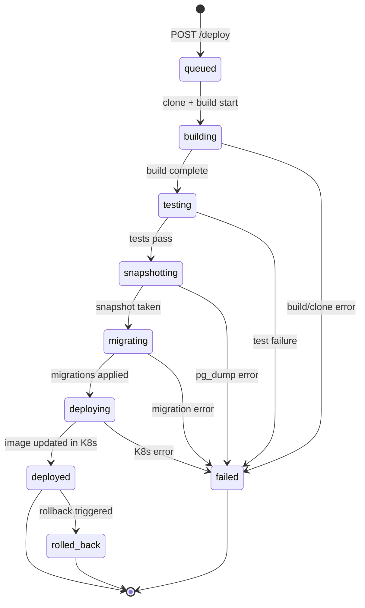

# Deploy Pipeline

The deploy pipeline is a seven-step process that takes a commit SHA and produces a running container in Kubernetes. Every step is persisted in PostgreSQL, and progress streams to the UI and CLI in real-time over WebSocket.

## Pipeline steps

| Step | What happens | On failure |
|------|-------------|------------|
| **Clone** | Clone repo (or copy local source) into temp directory | Pipeline stops |
| **Build** | `docker build -t app:sha .` | Pipeline stops |
| **Test** | Run test command in the work directory | Pipeline stops |
| **Snapshot** | `pg_dump` of the app's database | Pipeline stops |
| **Migrate** | Run schema migration command | Pipeline stops, snapshot available for restore |
| **Deploy** | Update K8s Deployment image (or register with cron scheduler) | Rollback available |
| **Cleanup** | Remove temporary work directory | Best-effort |

## State machine



## Step details

### Clone

For apps with a `repo` configured, clones the Git repository:

```
git clone --depth 1 --branch <branch> <url> <workdir>
```

Supports both HTTPS (with token via `GIT_ASKPASS`) and SSH (with key via `GIT_SSH_COMMAND`). If the clone fails and a local copy exists in `NORN_APPS_DIR`, it falls back to copying the local files.

For local-only apps (no `repo`), copies the app directory into a temp work directory.

After cloning, the actual HEAD SHA is resolved and used as the image tag.

### Build

Runs `docker build` with the configured Dockerfile:

```
docker build -t <app>:<sha> <workdir>
```

If a container registry is configured (`NORN_REGISTRY_URL`), the image is tagged and pushed:

```
docker tag <app>:<sha> <registry>/<app>:<sha>
docker push <registry>/<app>:<sha>
```

Otherwise, for minikube environments, loads the image directly:

```
minikube image load <app>:<sha>
```

Skipped if no `build` spec is configured.

### Test

Runs the test command from the `build.test` field in the app's work directory:

```
sh -c "<test command>"
```

Skipped if no test command is configured.

### Snapshot

Creates a pre-migration database backup:

```
pg_dump -Fc -d <database> -f snapshots/<db>_<sha>_<timestamp>.dump
```

The custom format (`-Fc`) allows selective restore. Snapshots are only created for apps with a PostgreSQL dependency.

### Migrate

Runs the migration command from the infraspec:

```
sh -c "<migrations.command>"
```

If migration fails, the snapshot from the previous step can be used to restore the database.

### Deploy

For regular apps, updates the Kubernetes Deployment image:

```go
Kube.SetImage(ctx, "default", appID, appID, imageTag)
```

For cron apps, registers the new image with the scheduler:

```go
Scheduler.SetImage(appID, imageTag)
```

### Cleanup

Removes the temporary work directory created during the clone step. This is best-effort — cleanup failures don't fail the pipeline.

## WebSocket events

The pipeline broadcasts events at each step change:

| Event | When | Payload |
|-------|------|---------|
| `deploy.queued` | Deploy created | Full deployment object |
| `deploy.step` | Step starts/completes | `{step, status}` |
| `deploy.failed` | Any step fails | Full deployment with error |
| `deploy.completed` | Pipeline finishes | Full deployment object |

## Crash recovery

If Norn restarts while a deploy is in progress, the `RecoverInFlightDeployments` function marks all in-flight deploys as failed:

```sql
UPDATE deployments
SET status = 'failed',
    error = 'norn restarted during deployment',
    finished_at = now()
WHERE status NOT IN ('deployed', 'failed', 'rolled_back')
```

This prevents inconsistent state — no deployment is ever left in a partial state.

## Interactive simulator

Visualize how the pipeline works step by step:

<PipelineSimulator />
