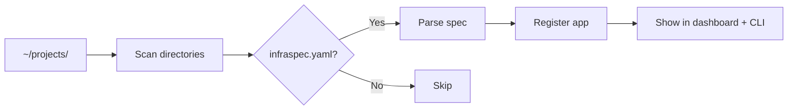

# Concepts

## App discovery

Norn scans a directory (default: `~/projects/`) for subdirectories containing an `infraspec.yaml` file. Each discovered file represents one app.



The scan happens on every API request to `/api/apps`, so new apps appear immediately — no restart needed. The scan directory is configured via `NORN_APPS_DIR` (default `~/projects`).

## infraspec.yaml

The infraspec is the single source of truth for an app's infrastructure requirements. It declares:

- **Identity**: app name, role, port
- **Build**: Dockerfile path, test command
- **Networking**: external hostname, internal service name, healthcheck path
- **Services**: PostgreSQL database, Valkey namespace, Redpanda topics
- **Secrets**: list of secret key names
- **Migrations**: command to run schema migrations
- **Artifacts**: how many image tags to retain

See the [Infraspec Reference](/guide/infraspec-reference) for every field.

## App roles

Every app has a `role` that determines how Norn handles it:

### `webserver`

Long-running HTTP server. Gets a Kubernetes Deployment, Service, and optional Cloudflare tunnel route. Has a healthcheck endpoint.

```yaml
app: mail-agent
role: webserver
port: 80
healthcheck: /health
hosts:
  external: mail.slopistry.com
  internal: mail-agent-service
```

### `worker`

Long-running background process. Gets a Kubernetes Deployment but no Service or ingress. No healthcheck endpoint.

```yaml
app: queue-processor
role: worker
```

### `cron`

Scheduled task. No Kubernetes Deployment — instead, Norn's built-in scheduler runs the container on a cron schedule. The forge step for cron apps simply registers the schedule rather than creating K8s resources.

```yaml
app: daily-report
role: cron
schedule: "0 9 * * *"
command: node generate-report.js
timeout: 300
```

### `function`

HTTP-triggered ephemeral container. Like cron, but invoked on-demand rather than on a schedule.

```yaml
app: thumbnail-gen
role: function
build:
  dockerfile: Dockerfile
function:
  timeout: 30
  trigger: http
  memory: 256m
```

## Service dependencies

Apps can declare dependencies on shared services. Norn provisions namespaced access to each:

### PostgreSQL

Per-app database. Norn creates the database during `make setup` or can provision it via the forge pipeline.

```yaml
services:
  postgres:
    database: mailagent_db
```

### Valkey (Redis-compatible)

Key-value store with ACL-based multi-tenancy. Each app gets a namespace prefix restriction.

```yaml
services:
  kv:
    namespace: mail-agent
```

### Redpanda (Kafka-compatible)

Event streaming with per-app topic prefixes and ACLs.

```yaml
services:
  events:
    topics: [mail.inbound, mail.processed]
```

### Object Storage (S3-compatible)

S3-compatible bucket storage. Uses MinIO locally, or Cloudflare R2 / AWS S3 / GCS in production.

```yaml
services:
  storage:
    bucket: my-app-uploads
    provider: minio
```

## Core apps

Apps with `core: true` are Norn infrastructure components (like Norn itself). They're visually distinguished in the dashboard and CLI.

```yaml
app: norn
role: webserver
core: true
```

## Repository-backed apps

Apps can specify a remote Git repository. During deploy, Norn clones the repo instead of copying from the local filesystem. If the clone fails, it falls back to the local copy.

```yaml
repo:
  url: git@github.com:user/myapp.git
  branch: main
  autoDeploy: true
  repoWeb: https://github.com/user/myapp
```

## Volumes

Apps can mount persistent volumes (PVC) or host paths:

```yaml
volumes:
  - name: data
    mountPath: /data
    size: 10Gi            # creates a PVC
  - name: projects
    mountPath: /projects
    hostPath: /Users/me/projects  # host mount
```

## Alerts

Health check alerts trigger when failures exceed a threshold within a time window:

```yaml
alerts:
  window: 5m      # default
  threshold: 3    # default — 3 failures in 5 minutes
```

## Deploy vs. Forge

These are two distinct operations:

| | **Forge** | **Deploy** |
|--|-----------|------------|
| **When** | Once, to set up infrastructure | Every time you ship code |
| **Creates** | K8s Deployment, Service, tunnel routes, DNS | Builds image, runs tests, applies to existing Deployment |
| **Idempotent** | Yes (skips existing resources) | No (creates a new deployment record) |
| **Reversible** | `norn teardown` removes everything | `norn rollback` reverts to previous image |
