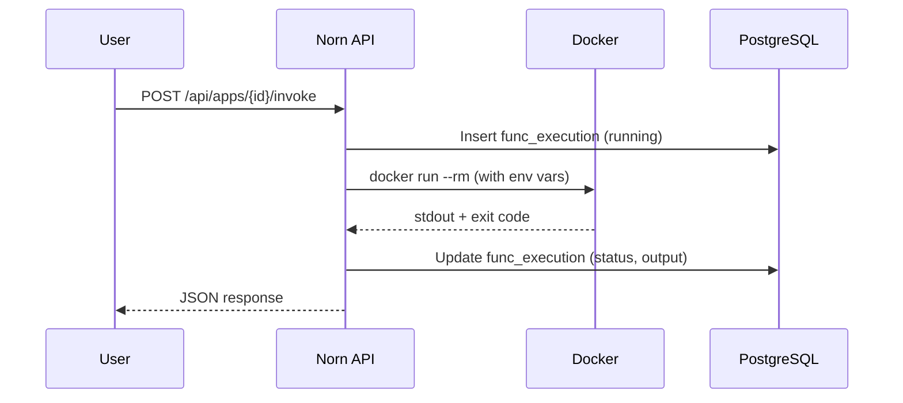
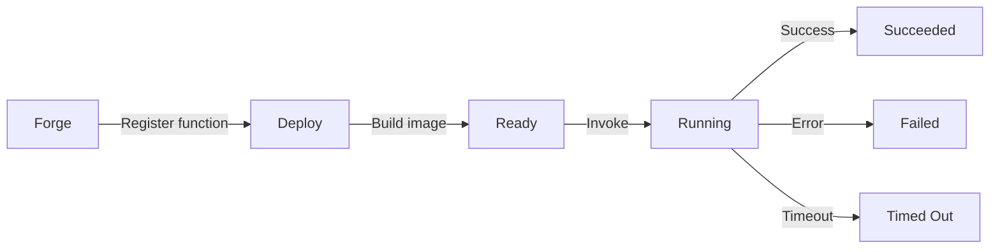

# Functions

Functions are HTTP-triggered ephemeral containers — lightweight serverless workloads managed by Norn.

## Overview

Unlike webservers (always running) or cron jobs (scheduled), functions run on demand. Each invocation:

1. Starts a container from the deployed image
2. Passes the request via environment variables
3. Captures stdout as the response
4. Records the execution in the database



## infraspec

```yaml
app: thumbnail-gen
role: function
build:
  dockerfile: Dockerfile
function:
  timeout: 30       # max seconds (default: 30)
  trigger: http     # trigger type (default: http)
  memory: 256m      # container memory limit (default: 256m)
```

### Fields

| Field | Type | Default | Description |
|-------|------|---------|-------------|
| `function.timeout` | int | `30` | Maximum execution time in seconds |
| `function.trigger` | string | `"http"` | Trigger type (currently only `http`) |
| `function.memory` | string | `"256m"` | Container memory limit |

## Protocol

The function container receives the request as environment variables:

| Variable | Description |
|----------|-------------|
| `NORN_REQUEST_BODY` | The request body (JSON string) |
| `NORN_REQUEST_METHOD` | HTTP method (POST) |
| `NORN_REQUEST_PATH` | Request path |

Plus any static `env` variables from the infraspec.

The container's stdout is captured as the response. Exit code 0 = success.

## Example function

### Go

```go
package main

import (
    "encoding/json"
    "fmt"
    "os"
)

func main() {
    body := os.Getenv("NORN_REQUEST_BODY")

    var req struct {
        URL string `json:"url"`
    }
    json.Unmarshal([]byte(body), &req)

    // Process the request...
    result := map[string]string{
        "status": "processed",
        "input":  req.URL,
    }

    out, _ := json.Marshal(result)
    fmt.Println(string(out))
}
```

### Node.js

```javascript
const body = JSON.parse(process.env.NORN_REQUEST_BODY || '{}')

// Process the request...
const result = {
  status: 'processed',
  input: body.url
}

console.log(JSON.stringify(result))
```

## Invoking

### UI

1. Click the **Invoke** button on the function's app card
2. Enter a request body in the panel
3. Click **Invoke** to run
4. View the result in the execution history

### CLI

```bash
# Simple invocation
norn invoke my-func --body '{"key": "value"}'

# From a file
norn invoke my-func --body @request.json

# Empty body
norn invoke my-func
```

### API

```bash
curl -X POST http://localhost:8800/api/apps/my-func/invoke \
  -H 'Content-Type: application/json' \
  -d '{"key": "value"}'
```

## Execution history

View past invocations:

- **UI**: Click **History** on the function's app card
- **API**: `GET /api/apps/{id}/function/history`

Each execution record includes:
- Status (running, succeeded, failed, timed_out)
- Exit code
- Container output
- Duration in milliseconds
- Timestamps

## Lifecycle


