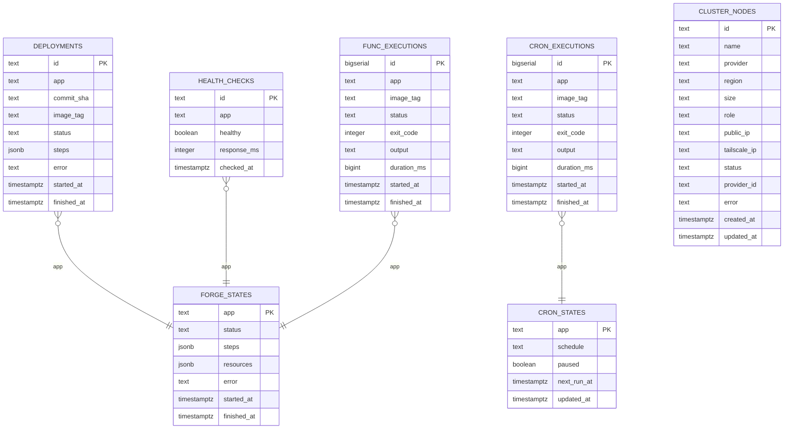

# Data Model

Norn persists all state in PostgreSQL using pgx. The schema is auto-migrated on startup.

## Entity relationship diagram



## Tables

### `deployments`

Tracks every deploy attempt with full step-by-step logs.

| Column | Type | Description |
|--------|------|-------------|
| `id` | `TEXT PK` | UUID |
| `app` | `TEXT` | App identifier |
| `commit_sha` | `TEXT` | Git commit SHA |
| `image_tag` | `TEXT` | Docker image tag (e.g. `myapp:abc123def456`) |
| `status` | `TEXT` | One of: `queued`, `building`, `testing`, `snapshotting`, `migrating`, `deploying`, `deployed`, `failed`, `rolled_back` |
| `steps` | `JSONB` | Array of step logs with name, status, duration, output |
| `error` | `TEXT` | Error message if failed |
| `started_at` | `TIMESTAMPTZ` | When the deploy was queued |
| `finished_at` | `TIMESTAMPTZ` | When the deploy completed or failed |

Indexes: `idx_deployments_app`, `idx_deployments_status`

### `forge_states`

One row per app, tracking infrastructure provisioning state.

| Column | Type | Description |
|--------|------|-------------|
| `app` | `TEXT PK` | App identifier |
| `status` | `TEXT` | One of: `unforged`, `forging`, `forged`, `forge_failed`, `tearing_down` |
| `steps` | `JSONB` | Array of forge step logs |
| `resources` | `JSONB` | Created resources (deployment name, service name, hosts, DNS/tunnel flags) |
| `error` | `TEXT` | Error message if failed |
| `started_at` | `TIMESTAMPTZ` | When the operation started |
| `finished_at` | `TIMESTAMPTZ` | When the operation completed |

### `health_checks`

Health check results from periodic polling.

| Column | Type | Description |
|--------|------|-------------|
| `id` | `TEXT PK` | UUID |
| `app` | `TEXT` | App identifier |
| `healthy` | `BOOLEAN` | Whether the check passed |
| `response_ms` | `INTEGER` | Response time in milliseconds |
| `checked_at` | `TIMESTAMPTZ` | When the check ran |

Index: `idx_health_checks_app_time` (app, checked_at DESC)

Pruned automatically — records older than 24 hours are deleted.

### `cron_executions`

Tracks every cron job execution.

| Column | Type | Description |
|--------|------|-------------|
| `id` | `BIGSERIAL PK` | Auto-increment |
| `app` | `TEXT` | App identifier |
| `image_tag` | `TEXT` | Docker image used |
| `status` | `TEXT` | `running`, `completed`, `failed` |
| `exit_code` | `INT` | Container exit code |
| `output` | `TEXT` | Container stdout/stderr |
| `duration_ms` | `BIGINT` | Execution duration |
| `started_at` | `TIMESTAMPTZ` | When execution started |
| `finished_at` | `TIMESTAMPTZ` | When execution completed |

### `func_executions`

Tracks every function invocation.

| Column | Type | Description |
|--------|------|-------------|
| `id` | `BIGSERIAL PK` | Auto-increment |
| `app` | `TEXT` | App identifier |
| `image_tag` | `TEXT` | Docker image used |
| `status` | `TEXT` | `running`, `succeeded`, `failed`, `timed_out` |
| `exit_code` | `INT` | Container exit code |
| `output` | `TEXT` | Container stdout/stderr |
| `duration_ms` | `BIGINT` | Execution duration |
| `started_at` | `TIMESTAMPTZ` | When execution started |
| `finished_at` | `TIMESTAMPTZ` | When execution completed |

### `cron_states`

One row per cron app, tracking schedule and pause state.

| Column | Type | Description |
|--------|------|-------------|
| `app` | `TEXT PK` | App identifier |
| `schedule` | `TEXT` | Cron expression |
| `paused` | `BOOLEAN` | Whether scheduling is paused |
| `next_run_at` | `TIMESTAMPTZ` | Next scheduled execution |
| `updated_at` | `TIMESTAMPTZ` | Last state change |

### `cluster_nodes`

Tracks provisioned cluster nodes across cloud providers.

| Column | Type | Description |
|--------|------|-------------|
| `id` | `TEXT PK` | UUID |
| `name` | `TEXT` | Node name (e.g. `norn-server-1`) |
| `provider` | `TEXT` | Cloud provider (`hetzner`, `digitalocean`, `vultr`) |
| `region` | `TEXT` | Region code |
| `size` | `TEXT` | Instance size |
| `role` | `TEXT` | `server` or `agent` |
| `public_ip` | `TEXT` | Public IP address |
| `tailscale_ip` | `TEXT` | Tailscale mesh IP |
| `status` | `TEXT` | `provisioning`, `ready`, `draining`, `removed` |
| `provider_id` | `TEXT` | Cloud provider resource ID |
| `error` | `TEXT` | Error message |
| `created_at` | `TIMESTAMPTZ` | When the node was created |
| `updated_at` | `TIMESTAMPTZ` | Last status change |

## Step log format

Both deploy and forge pipelines store step logs as JSONB arrays:

```json
[
  {
    "step": "clone",
    "status": "deployed",
    "durationMs": 1234,
    "output": "cloned git@github.com:user/app.git (branch main) at abc123def456"
  },
  {
    "step": "build",
    "status": "deployed",
    "durationMs": 45678,
    "output": "..."
  }
]
```

## Crash recovery

On startup, Norn marks all in-flight operations as failed:

- **Deployments**: Any deployment not in `deployed`, `failed`, or `rolled_back` status is marked `failed` with error `"norn restarted during deployment"`
- **Forge states**: Any forge in `forging` or `tearing_down` status is marked `forge_failed` with error `"norn restarted during operation"`

This ensures no operations are ever left in an indeterminate state.
