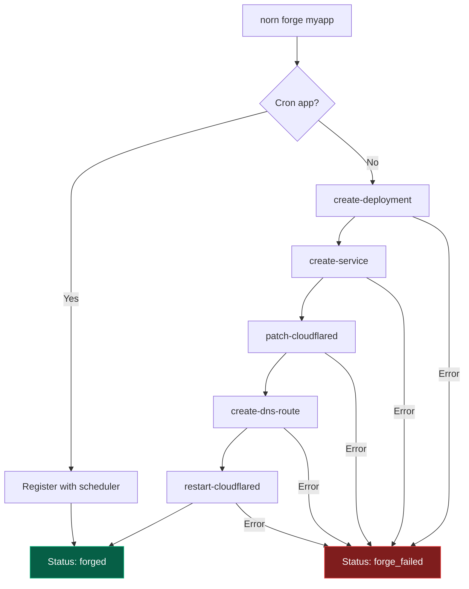
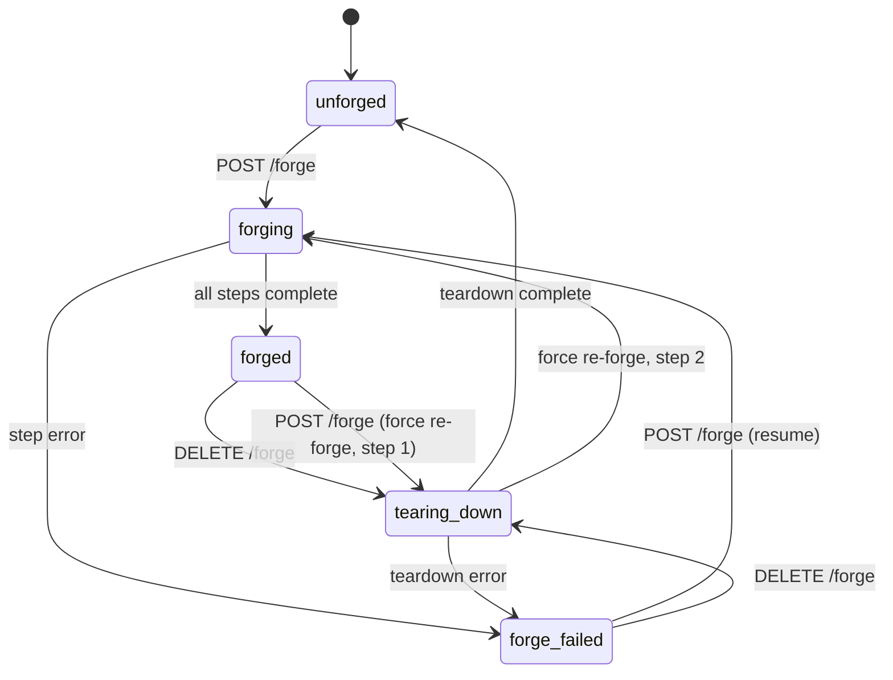

# Forge Pipeline

The forge pipeline provisions Kubernetes infrastructure for an app. Unlike the deploy pipeline (which runs on every code push), forge typically runs once when an app is first set up.

## Pipeline flow



## Steps

### 1. create-deployment

Creates a Kubernetes Deployment for the app:

- Image: `<app>:latest` (will be updated by deploy pipeline)
- Port, replicas, healthcheck from infraspec
- Secret references (if `secrets` configured)
- Environment variables from `env` and auto-generated `DATABASE_URL` (if postgres service configured)
- Volume mounts (PVCs created automatically, or host path mounts)

If the deployment already exists, it's skipped (idempotent).

### 2. create-service

Creates a Kubernetes Service mapping the internal hostname to the app's port:

```
<internal-host>:80 → <app>:<port>
```

Skipped if no `hosts.internal` is configured.

### 3. patch-cloudflared

Patches the Cloudflare tunnel ConfigMap to add an ingress rule routing the external hostname to the internal service:

```yaml
# Added to cloudflared ConfigMap ingress rules:
- hostname: mail.slopistry.com
  service: http://mail-agent-service.default.svc.cluster.local:80
```

The rule is inserted before the catch-all 404 rule. Skipped if no `hosts.external` is configured or if cloudflared is not deployed.

### 4. create-dns-route

Registers a DNS CNAME record pointing the external hostname to the Cloudflare tunnel:

```
cloudflared tunnel route dns <tunnel-name> <hostname>
```

Skipped if cloudflared CLI is not available or no external host is configured.

### 5. restart-cloudflared

Rolling restart of the cloudflared deployment to pick up the new ConfigMap:

```
kubectl rollout restart deployment/cloudflared -n cloudflared
```

## Forge states



## Teardown pipeline

Teardown is the reverse of forge — it removes all infrastructure created for an app:

| Step | What happens |
|------|-------------|
| **remove-dns-route** | Remove Cloudflare DNS CNAME (best-effort) |
| **unpatch-cloudflared** | Remove ingress rule from ConfigMap |
| **restart-cloudflared** | Rolling restart to apply config |
| **delete-service** | Delete K8s Service |
| **delete-deployment** | Delete K8s Deployment |

## Resume on failure

If a forge fails mid-way, calling `POST /forge` again resumes from the last completed step. Already-completed steps are marked as "skipped" in the new run.

## Force re-forge

If an app is already forged, you can force a re-forge by passing `{"force": true}`. This runs teardown first, then a fresh forge.

## WebSocket events

| Event | When | Payload |
|-------|------|---------|
| `forge.queued` | Forge started | `{app}` |
| `forge.step` | Step starts/completes/fails | `{step, status, output?, durationMs?}` |
| `forge.failed` | Pipeline fails | `{step, error}` |
| `forge.completed` | All steps done | `{}` |
| `teardown.queued` | Teardown started | `{app}` |
| `teardown.step` | Step starts/completes/fails | `{step, status, output?, durationMs?}` |
| `teardown.failed` | Teardown fails | `{step, error}` |
| `teardown.completed` | Teardown done | `{}` |
