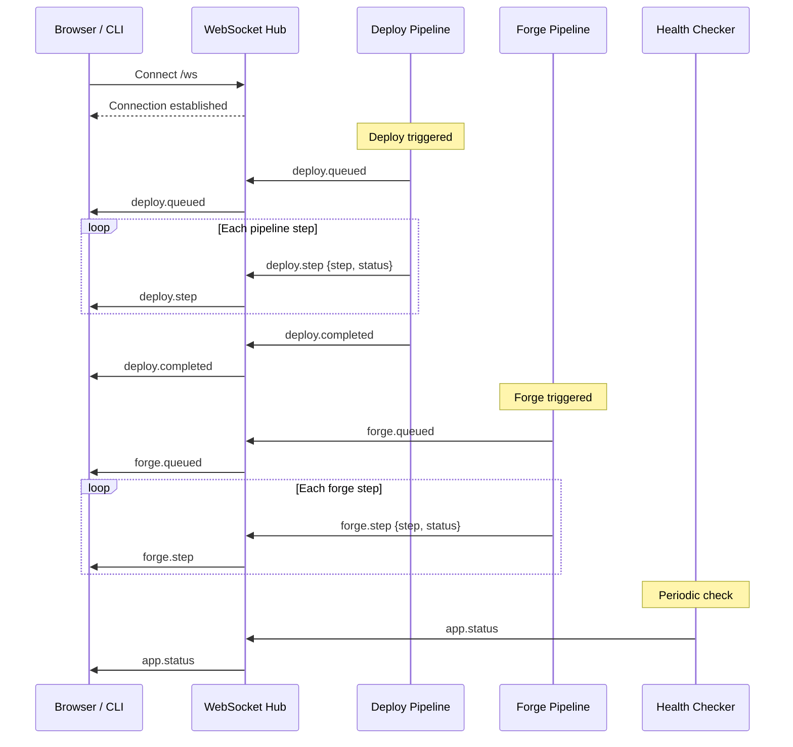

# WebSocket

Norn uses WebSocket for real-time event streaming. The UI and CLI both connect to receive live updates about deploys, forge operations, app status changes, and health events.

## Connection

Connect to `ws://localhost:8800/ws` (or `wss://` in production). No authentication is currently required — origin checking allows localhost and configured origins.

## Event flow



## Hub architecture

The WebSocket hub is a standard pub/sub broadcast pattern:

```go
type Hub struct {
    clients    map[*client]bool
    broadcast  chan []byte
    register   chan *client
    unregister chan *client
}
```

- **`register`** — new client connects, added to the clients map
- **`unregister`** — client disconnects, removed from map, send channel closed
- **`broadcast`** — message sent to all connected clients via their send channels
- Each client has a `send` channel (buffered, 64 messages) and runs a write pump goroutine
- Slow clients that can't keep up have their send channel closed (they're dropped)

## Event types

### Deploy events

| Event | Payload | When |
|-------|---------|------|
| `deploy.queued` | Full `Deployment` object | Deploy created |
| `deploy.step` | `{step: string, status: string}` | Each step starts |
| `deploy.failed` | Full `Deployment` with error | Any step fails |
| `deploy.completed` | Full `Deployment` object | Pipeline finishes successfully |
| `deploy.rollback` | `{imageTag: string}` | Rollback triggered |

### Forge events

| Event | Payload | When |
|-------|---------|------|
| `forge.queued` | `{app: string}` | Forge started |
| `forge.step` | `{step, status, output?, durationMs?}` | Each step starts/completes |
| `forge.failed` | `{step: string, error: string}` | Step fails |
| `forge.completed` | `{}` | All steps done |

### Teardown events

| Event | Payload | When |
|-------|---------|------|
| `teardown.queued` | `{app: string}` | Teardown started |
| `teardown.step` | `{step, status, output?, durationMs?}` | Each step |
| `teardown.failed` | `{step: string, error: string}` | Step fails |
| `teardown.completed` | `{}` | Teardown done |

### App events

| Event | Payload | When |
|-------|---------|------|
| `app.restarted` | `{appId: string}` | Restart triggered |
| `app.status` | App status object | Health check update |

## Event format

All events are JSON with the same envelope:

```json
{
  "type": "deploy.step",
  "appId": "mail-agent",
  "payload": {
    "step": "build",
    "status": "building"
  }
}
```

## CLI integration

The CLI uses Bubble Tea's channel pattern for WebSocket streaming. A goroutine reads WebSocket messages and pushes them into a channel, which Bubble Tea consumes as commands:

```go
// Goroutine reads from WebSocket
go func() {
    for {
        _, msg, err := conn.ReadMessage()
        if err != nil { break }
        ch <- wsMessage{data: msg}
    }
}()

// Bubble Tea command waits for next event
func waitForEvent(ch chan tea.Msg) tea.Cmd {
    return func() tea.Msg {
        return <-ch
    }
}
```

This pattern allows the TUI to render pipeline progress with spinners, step indicators, and live output — matching the UI's real-time experience.

## Origin checking

The upgrader checks the `Origin` header:

1. Empty origin (non-browser clients like CLI or curl) — **allowed**
2. Origin in the configured allowed origins list — **allowed**
3. Localhost origins (`localhost`, `127.0.0.1`, `::1`) — **always allowed**
4. Everything else — **rejected**
