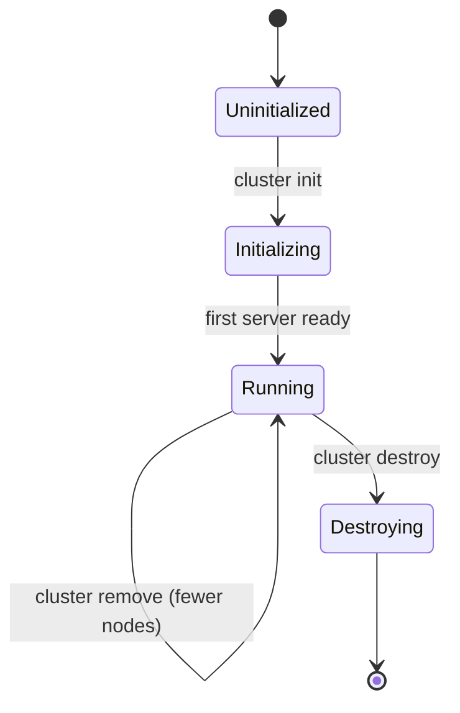

# Cluster Management

The `norn cluster` commands manage k3s cluster nodes across multiple cloud providers using Terraform.

## Cluster lifecycle



## Supported providers

| Provider | Flag value | Instance sizes |
|----------|-----------|----------------|
| **Hetzner** | `hetzner` | `cx22`, `cx32`, `cx42`, etc. |
| **DigitalOcean** | `digitalocean` | `s-1vcpu-2gb`, `s-2vcpu-4gb`, etc. |
| **Vultr** | `vultr` | Vultr plan IDs |

## Commands

### cluster init

Initialize a new cluster with the first server node.

```bash
norn cluster init --provider hetzner --size cx22 --region fsn1
norn cluster init --provider hetzner --size cx22 --region fsn1 --name my-server
```

| Flag | Required | Default | Description |
|------|----------|---------|-------------|
| `--provider` | Yes | — | Cloud provider (`hetzner`, `digitalocean`, `vultr`) |
| `--size` | No | — | Instance size |
| `--region` | No | — | Region code |
| `--name` | No | `norn-server-1` | Node name |

**Pipeline steps:**

1. **terraform-init** — Initialize Terraform modules
2. **terraform-apply** — Provision the server
3. **poll-ready** — Wait for node to be reachable
4. **register-node** — Register node in Norn database
5. **merge-kubeconfig** — Merge kubeconfig for cluster access

Shows a live TUI with step-by-step progress, spinners, and cost estimate.

### cluster add

Add a worker (agent) node to the cluster.

```bash
norn cluster add --provider hetzner --size cx22 --region fsn1 --name worker-1
```

| Flag | Required | Default | Description |
|------|----------|---------|-------------|
| `--provider` | Yes | — | Cloud provider |
| `--size` | No | — | Instance size |
| `--region` | No | — | Region code |
| `--name` | Yes | — | Node name |
| `--role` | No | `agent` | Node role (`server` or `agent`) |

### cluster remove

Remove a node from the cluster.

```bash
norn cluster remove <node-name>
```

Drains the node, removes it from the cluster, and destroys the cloud resource via Terraform.

### cluster destroy

Destroy the entire cluster.

```bash
norn cluster destroy
```

Removes all nodes and runs `terraform destroy`. Prompts for confirmation.

### cluster nodes

List all cluster nodes with status.

```bash
norn cluster nodes
```

Shows a table with:
- Node name
- Provider and region
- Instance size
- Role (server/agent)
- Public IP
- Tailscale IP
- Status (provisioning/ready/draining/removed)

### cluster kubeconfig

Display or merge the cluster kubeconfig.

```bash
norn cluster kubeconfig
```

### cluster cost

Show estimated monthly costs.

```bash
norn cluster cost
```

Shows per-node costs and total cluster cost based on provider pricing.

## Terraform integration

The CLI wraps Terraform for infrastructure provisioning. The Terraform configuration lives in `infra/terraform/` and supports multi-provider deployments:

```
infra/terraform/
├── main.tf          # Provider configs, module instantiation
├── variables.tf     # Node definitions, credentials
├── outputs.tf       # Node IPs, kubeconfig
└── modules/
    ├── hetzner/     # Hetzner Cloud server resource
    ├── digitalocean/ # DigitalOcean droplet resource
    ├── vultr/       # Vultr instance resource
    └── k3s-node/    # Cloud-init template for k3s bootstrap
```

Nodes are defined as a map in `variables.tf`:

```hcl
variable "nodes" {
  type = map(object({
    provider = string  # hetzner, digitalocean, vultr
    region   = string
    size     = string
    role     = string  # server, agent
  }))
}
```

Each node gets a cloud-init script that:
1. Installs k3s (server or agent role)
2. Joins the cluster using a shared token
3. Enrolls in Tailscale for mesh networking

## Node roles

| Role | Description |
|------|-------------|
| **server** | Runs k3s server (control plane + etcd). The first server initializes the cluster. |
| **agent** | Runs k3s agent (worker only). Joins the cluster via the first server's API. |
