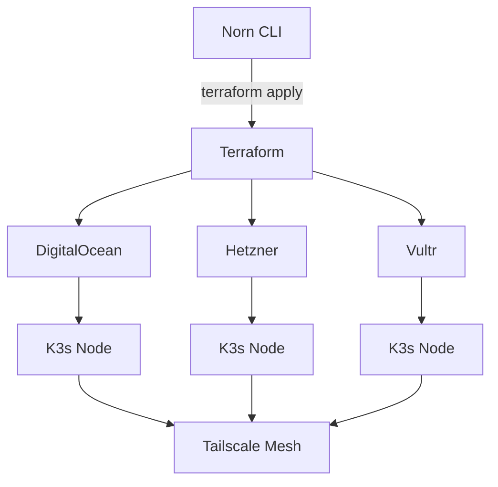

# Cloud Providers

Norn includes Terraform modules for provisioning K3s cluster nodes across multiple cloud providers.

## Supported providers

| Provider | Module | Strengths |
|----------|--------|-----------|
| **DigitalOcean** | `infra/terraform/digitalocean/` | Simple pricing, good API, included monitoring |
| **Hetzner** | `infra/terraform/hetzner/` | Best price/performance in EU, ARM64 support |
| **Vultr** | `infra/terraform/vultr/` | Global regions, bare metal options |

## Architecture



Nodes from different providers join the same K3s cluster via Tailscale mesh networking.

## Cluster management

```bash
# Initialize a new cluster
norn cluster init --provider hetzner --region fsn1 --size cx22

# Add nodes
norn cluster add --provider digitalocean --region nyc1 --size s-2vcpu-4gb
norn cluster add --provider vultr --region ewr --size vc2-2c-4gb

# List nodes
norn cluster nodes

# Get kubeconfig
norn cluster kubeconfig > ~/.kube/config

# Estimate costs
norn cluster cost

# Remove a node
norn cluster remove <node-id>

# Destroy the entire cluster
norn cluster destroy
```

## Node provisioning

Each node is provisioned with cloud-init that:

1. Installs K3s (server or agent role)
2. Installs Tailscale for mesh networking
3. Configures firewall rules
4. Joins the cluster using the server's Tailscale IP

The `k3s-node` Terraform module (`infra/terraform/k3s-node/`) handles the common provisioning logic, while provider-specific modules handle VM creation.

## Provider setup

### DigitalOcean

```bash
export DIGITALOCEAN_TOKEN=<your-token>
```

### Hetzner

```bash
export HCLOUD_TOKEN=<your-token>
```

### Vultr

```bash
export VULTR_API_KEY=<your-key>
```

## Cost optimization

- **Hetzner CAX** (ARM64) instances offer the best price/performance for most workloads
- **DigitalOcean** basic droplets are competitive for US regions
- Mix providers for geographic distribution and redundancy
- Use `norn cluster cost` to estimate monthly costs
