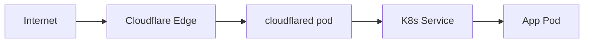
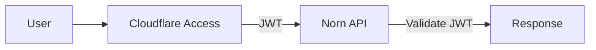

# Cloudflare Integration

Norn uses Cloudflare Tunnel and Cloudflare Access for secure connectivity and authentication.

## Cloudflare Tunnel

Norn's forge pipeline automatically configures Cloudflare Tunnel routing for apps with `hosts.external` set.

### How it works



1. A `cloudflared` deployment runs in Kubernetes, maintaining an outbound connection to Cloudflare's edge
2. When you **forge** an app with `hosts.external`, Norn:
   - Patches the `cloudflared` ConfigMap to add an ingress rule
   - Runs `cloudflared tunnel route dns` to create a DNS record
   - Restarts the `cloudflared` deployment to pick up the config change

### Forge steps

The forge pipeline (`api/pipeline/forge.go`) includes three Cloudflare-specific steps:

1. **patch-cloudflared** — Adds an ingress rule to the cloudflared ConfigMap:
   ```yaml
   ingress:
     - hostname: mail.slopistry.com
       service: http://mail-agent-service.default.svc.cluster.local:80
     - service: http_status:404  # catch-all (always last)
   ```

2. **create-dns-route** — Creates a CNAME record pointing the hostname to the tunnel:
   ```bash
   cloudflared tunnel route dns <tunnel-name> mail.slopistry.com
   ```

3. **restart-cloudflared** — Rolling restart to pick up the new config

### Configuration

| Variable | Default | Description |
|----------|---------|-------------|
| `NORN_TUNNEL_NAME` | `norn` | Name of the Cloudflare tunnel |

The tunnel must be pre-created:

```bash
cloudflared tunnel create norn
cloudflared tunnel token norn  # save this for the K8s secret
```

### Teardown

When you teardown an app, Norn removes the cloudflared ingress rule and restarts the deployment. DNS records are not automatically deleted (Cloudflare manages TTL).

## Cloudflare Access

Norn supports Cloudflare Access JWT validation for zero-trust authentication.

### How it works



When configured, Norn validates the `Cf-Access-Jwt-Assertion` header on every request (except health checks and WebSocket).

### Configuration

| Variable | Description |
|----------|-------------|
| `NORN_CF_ACCESS_TEAM_DOMAIN` | Your Cloudflare Access team domain (e.g. `myteam.cloudflareaccess.com`) |
| `NORN_CF_ACCESS_AUD` | Application AUD tag from the Access application settings |

When both are set, Norn fetches Cloudflare's public keys and validates JWTs using `golang-jwt`.

### Setup

1. Create a Cloudflare Access application for your Norn domain
2. Copy the Application AUD from the application settings
3. Set the environment variables:
   ```bash
   export NORN_CF_ACCESS_TEAM_DOMAIN=myteam.cloudflareaccess.com
   export NORN_CF_ACCESS_AUD=abc123...
   ```

### Auth stack

Norn supports multiple auth layers that can be used independently or together:

| Layer | When active | What it does |
|-------|-------------|--------------|
| **Cloudflare Access** | `CF_ACCESS_TEAM_DOMAIN` + `CF_ACCESS_AUD` set | Validates JWT from Cloudflare |
| **Bearer token** | `NORN_API_TOKEN` set | Validates `Authorization: Bearer <token>` header |
| **No auth** | Neither configured | All requests allowed (local dev) |

Endpoints always excluded from auth: `/ws`, `/api/health`, `/api/version`, `/api/webhooks/push`
