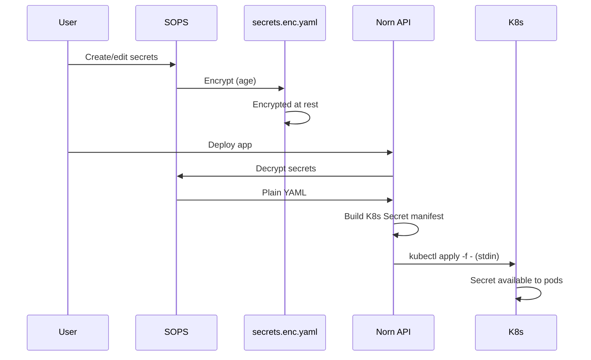

# Secrets

Norn uses SOPS with age encryption to manage secrets at rest. Secrets are encrypted in the repository and decrypted only when needed for deployment or API access.

## Configuration

The `.sops.yaml` file at the repository root defines encryption rules:

```yaml
creation_rules:
  - path_regex: secrets\.enc\.yaml$
    age: age1xa3ewyetky88fk9nw0j3lfyrnu6wul82vvm9vluaknfnkwtxnelqdzzsvw
```

This rule ensures any file matching `secrets.enc.yaml` is encrypted with the specified age public key.

## Storage

Each application stores its secrets in `~/projects/<app>/secrets.enc.yaml`. The file contains encrypted key-value pairs that are safe to commit to version control.

## Encryption and Decryption

Encrypt a secrets file:

```bash
sops --encrypt --input-type yaml --output-type yaml secrets.yaml > secrets.enc.yaml
```

Decrypt a secrets file:

```bash
sops --decrypt secrets.enc.yaml
```

The age private key must be available at `~/.config/sops/age/keys.txt`. On macOS, this is also symlinked to `~/Library/Application Support/sops/age/keys.txt` for compatibility.

## Secrets Manager

The secrets manager in `api/secrets/sops.go` provides programmatic access to encrypted secrets:

- **List**: Returns secret key names only (values never exposed)
- **Get**: Decrypts and returns secret values
- **Set**: Updates values and re-encrypts the file
- **Delete**: Removes a secret key
- **SyncToK8s**: Creates a Kubernetes Secret and applies it to the cluster

## Kubernetes Sync

The `SyncToK8s` operation:

1. Decrypts `secrets.enc.yaml`
2. Builds a Kubernetes Secret manifest with name `<app>-secrets`
3. Pipes the manifest via stdin to `kubectl apply -f -`

Values are never exposed in process arguments or shell history.

## API Endpoints

- `GET /api/apps/:id/secrets`: List secret key names
- `PUT /api/apps/:id/secrets`: Update secret values

The UI displays secret names only. Values never leave the server unless explicitly decrypted via API calls.

## Secrets Flow



## Security Model

- Secrets are encrypted at rest in the repository
- The age private key is required for all decrypt operations
- Kubernetes Secrets are created on-demand during deployment
- API endpoints expose metadata (key names) but require explicit actions to decrypt values
- No secrets appear in shell history or process listings
