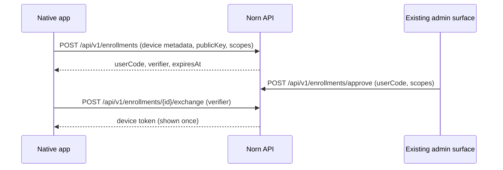

# Native control protocol

Norn exposes a versioned control contract for native apps, automation, and the
CLI. The source of truth is the OpenAPI 3.1 document at:

```text
GET /api/v1/openapi.yaml
```

The document is also checked into the API source as
`v2/api/contract/control-v1.openapi.yaml`. A Swift client should generate its
transport types from this file and keep view models separate from generated
types. At startup it should call `GET /api/v1/capabilities` and gate optional
features using the returned feature names instead of inferring support from the
server version.

## Stable errors

Versioned endpoints return `application/problem+json`. `code` is the stable
machine value; `detail` is for people and can change without a protocol bump.
The deprecated `error` field mirrors `detail` while older clients migrate.

```json
{
  "type": "https://norn.dev/problems/event_cursor_gap",
  "title": "Conflict",
  "status": 409,
  "code": "event_cursor_gap",
  "detail": "the requested cursor is older than retained event history",
  "requestId": "..."
}
```

Clients should branch on `status` and `code`, never `title`, `detail`, or
`error`. Response status and problem schemas are declared beside each operation
in OpenAPI. Stable code families include `invalid_*`, `*_not_found`, `insufficient_scope`,
`operation_not_cancelable`, `event_cursor_gap`, `managed_device_required`, and
`exec_step_up_required`.

## Device enrollment and token lifecycle

The native app does not ask the user to paste `NORN_API_TOKEN`. It creates a
P-256 signing key in the Keychain or Secure Enclave and starts a pairing
session:



The user code and verifier expire after ten minutes. Only hashes are stored.
The verifier is high entropy and must remain on the requesting device. Pairing
cannot grant `admin`; the approving administrator can reduce the requested
scopes. The bearer token is returned once and belongs in the Keychain. Norn
stores only its ID, scopes, device, timestamps, and revocation state.

Lifecycle endpoints are:

| Endpoint | Authorization | Behavior |
|---|---|---|
| `POST /api/v1/auth/rotate` | current managed token | Atomically issues a replacement, revokes the current token, and cancels sessions authorized by it |
| `POST /api/v1/auth/revoke` | current managed token | Revokes the current token |
| `GET /api/v1/devices` | `admin` | Lists devices and token metadata, never bearer secrets |
| `DELETE /api/v1/devices/{id}` | `admin` | Revokes the device and every token issued to it |

The Norn macOS app implements this as the default **Add Server** flow. It keeps
the verifier only in the active pairing view, polls the exchange endpoint while
the code is valid, and persists only non-secret device/token metadata alongside
the server profile. The bearer credential remains device-only in Keychain. It
rotates automatically while the app is active when seven days or less remain,
and can be rotated manually from Settings.

An authenticated administrator can approve and audit enrollment from the CLI:

```bash
norn access enrollments --status pending
norn access approve ABCD-EFGH --scope api:read,events:read
norn access devices
norn access revoke-device <device-id> --confirm
```

Approval scopes must be a subset of the request and can never include `admin`.
Device revocation ends every managed token owned by that device. Removing a
profile on the Mac removes its local key and credential but cannot prove intent
to revoke server-side access, so use the administrator revoke command when
access must end immediately.

Rotation retires the current token before the client stores the replacement.
The macOS client writes the returned token to Keychain before updating profile
metadata. If the process or Keychain fails during that narrow handoff, the old
token is already invalid and the safe recovery is to enroll the Mac again.

Existing scoped JWTs remain valid until their original expiry. They do not gain
device proof-of-possession or falsely appear revocable when no registry record
exists.

New tokens carry an explicit managed-token marker and fail closed if their
registry row is missing or the registry is unavailable. JWT signing uses a
domain-separated key derived from `NORN_API_TOKEN`. Verification of the
previous raw-key signing form is bounded by
`NORN_LEGACY_TOKEN_SIGNING_UNTIL` and is disabled after that timestamp; the
v2.17 default retirement deadline is `2026-08-15T00:00:00Z`. Norn refuses
control secrets shorter than 32 bytes and refuses a non-loopback bind without
`NORN_API_TOKEN`.

Set `NORN_REQUIRE_EXPLICIT_AUTH=true` for a hardened control plane. In that
mode, non-public routes require either a bearer credential or a validated
Cloudflare Access principal, even from loopback, and temporary IP grants are
disabled. The browser UI therefore remains usable behind a configured
Cloudflare Access application without receiving the root bearer token.

Enrollment and every token-bearing response use `Cache-Control: no-store`.
Enrollment is limited per source and globally in PostgreSQL, expired requests
are pruned, and eight invalid verifier submissions lock an approved request.
Pairing is rejected unless it uses HTTPS or a direct, unforwarded loopback
connection. Forwarded HTTPS is accepted only from the loopback proxy trust
boundary. Admin approval and device
inventory require an explicit authenticated admin principal; loopback and
temporary IP-grant compatibility do not satisfy that boundary.

## Fleet documents and plans

Clients gate fleet UI on `fleet-v1`, `fleet-inventory`, and
`durable-fleet-capacity-plans`. The versioned routes validate uploaded
documents, expose a read-only desired-pool inventory, and record planning-only
operations. Invalid documents return a typed report with stable finding codes;
invalid request envelopes and unsafe plan requests return stable Problem codes.

`fleet.capacity-plan` receipts bind the reviewed fleet source digest to the
cluster, pool, proposed action, plan digest, optional workflow URL, and audit
signature. They are proof of operator intent, not proof that Terraform ran.
Provider apply evidence is produced by the `norn-fleet` infrastructure runner and
node enrollment/readiness evidence is produced by Norn assurance.

## Event continuity

`GET /api/v1/events/info` reports the oldest and latest retained cursors,
timestamps, event count, heartbeat range, supported filters, and whether gap
detection is active. Connect to `/api/v1/events` with:

| Query | Meaning |
|---|---|
| `after=<cursor>` | Replay events after the last durably processed cursor |
| `types=a,b` | Exact-match event type subscription |
| `apps=x,y` | Exact-match app subscription |
| `heartbeat=10..120` | Opt-in heartbeat interval in seconds |

A cursor older than retained history returns `event_cursor_gap`; one newer than
the stream returns `event_cursor_ahead`. Both responses include `eventBounds`.
The client must reconcile versioned REST resources and then resume from the
latest cursor. A heartbeat is liveness evidence, not operation completion.

## Operations and resources

Platform and host actions return durable operations. Terminal operations carry
a `norn.operation-receipt/v1` receipt with typed `platform`, `host`, or `app`
evidence. `POST /api/v1/operations/{id}/cancel` cancels queued work atomically.
Running work returns `operation_not_cancelable` until that operation kind has a
cooperative cancellation implementation.

Native navigation should use the versioned read surfaces:

- `GET /api/v1/apps` and `GET /api/v1/apps/{id}`
- `GET /api/v1/releases`
- `GET /api/v1/host/status`
- `GET /api/v1/production/readiness`
- `GET /api/v1/audit/mutations`
- `GET /api/v1/production/drills`
- `GET /api/v1/operations/{id}`

The production readiness resource uses the stable
`norn.production-readiness/v1` schema. A native client may render its checks and
remediation, but server startup and deploy admission remain authoritative; a
client must not infer readiness from a version number or hide failed gates.
Startup enforces static security prerequisites and deploy admission enforces
source and artifact provenance. Runtime-changing requests also enforce live
quorum, PostgreSQL recovery, and durable-audit checks. Recovery and identity
routes remain available. Audit events use `norn.mutation-audit/v1`; recovery
drill lists use `norn.recovery-drills/v1`. Native clients must preserve unknown
future integrity states and drill kinds.

## Exec sessions

The compatibility `/api/apps/{id}/exec` WebSocket remains available. Native
clients should use `norn.exec/v1`, which is durable, audited, expiring, and
requires explicit proof of possession.

1. Create `POST /api/v1/auth/step-up/challenges` for purpose `exec` and the app
   ID.
2. Ask the operating system to authorize use of the enrolled P-256 private key
   (for example, with user presence in the Keychain access control).
3. Sign the server's exact UTF-8 `signaturePayload` with ECDSA P-256/SHA-256 and
   send the base64url ASN.1 signature to the challenge verify endpoint.
4. Create `POST /api/v1/apps/{id}/exec-sessions` with the returned one-time
   capability in `X-Norn-Step-Up`.
5. Connect once to the returned `streamPath` using the normal bearer header.

The challenge and step-up capability expire after two minutes and are bound to
the exact managed access token, device, purpose, and app. Rotation or use from
a different token therefore requires a fresh proof. Creating a session consumes
the challenge in the same database transaction that writes the audit record. Sessions expire after
one hour or when the authorizing access token expires, whichever comes first.
Challenge and session creation have durable per-device abuse limits, with at
most three pending/running terminals per device. Running sessions interrupted by an API restart are marked failed with
`server_restarted`; pending sessions remain reconnectable until expiry.

Client frames have a monotonic `sequence` and one of these forms:

```json
{"frame":"input","sequence":1,"data":"ls -la\n"}
{"frame":"resize","sequence":2,"columns":120,"rows":40}
{"frame":"close-input","sequence":3}
```

Server frames are `ready`, `stdout`, `stderr`, `error`, and `exit`. Every server
frame includes its own monotonic sequence and timestamp. Input defaults to
`utf8` and may specify `base64`; output is UTF-8 when a chunk is valid and
base64 otherwise, preserving arbitrary bytes. The `exit` frame contains
`exitCode` and a typed reason. Invalid or non-monotonic client frames terminate
the session with a stable protocol error code. An explicitly selected
allocation is verified to be running and owned by the app named in the step-up
grant.

`GET /api/v1/exec-sessions` and `GET /api/v1/exec-sessions/{id}` expose audit
metadata: device and token IDs, app, allocation, task, a SHA-256 command digest,
connection and finish times, status, exit code, remote address, and user agent.
Argv is never returned by audit APIs and is erased from PostgreSQL when the
session connects; terminal input and output are never persisted. `DELETE`
cancels pending or running sessions and closes an active socket. Explicit token
or device revocation atomically cancels affected sessions and closes their
active sockets.

Control JSON bodies are capped at 64 KiB, have a bounded read deadline, and
reject unknown or trailing fields. WebSocket messages are capped at 64 KiB,
writes have bounded deadlines, replay cannot block the global event loop, and the
HTTP server applies header and idle timeouts. Both legacy and v1 exec verify
that a caller-supplied allocation belongs to the app in the authorized route.

## Security boundaries

Norn treats application repositories and InfraSpecs as trusted operational
code: deploy tests and migrations intentionally execute commands declared by
those sources. Review repository write access as control-plane access. Internal
service callbacks trust the Nomad/Consul service registry; the ContextDB
rollback callback validates the discovered URL, refuses redirects, and has a
bounded request timeout.

Token or device revocation atomically cancels matching sessions in PostgreSQL.
The owning API process closes local sockets immediately, while every connected
exec stream also polls its durable session state and closes within 500 ms when
another replica records cancellation. This keeps revocation effective across
multi-replica control planes without persisting terminal traffic.

## Compatibility policy

Additive schemas and new capability names do not change `protocolVersion`.
Removing a field, changing its meaning, or changing frame semantics requires a
new API or frame protocol version. Legacy endpoints stay available while the
CLI and UI migrate, but new native work should depend only on documented v1
resources and advertised capabilities.
