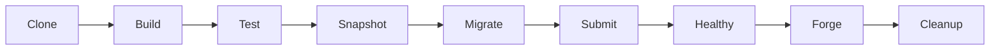
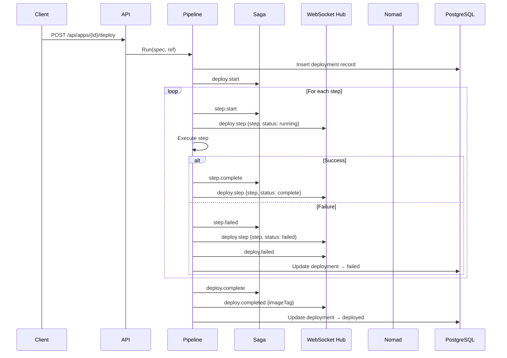

# Deploy Pipeline

The deploy pipeline is Norn's core orchestration flow. It takes an app from source code to running Nomad allocations in 9 sequential steps.

## Pipeline Steps

### 1. Clone

Checks out the git repository at the specified ref (commit SHA, branch, or tag). Uses `NORN_GIT_TOKEN` or `NORN_GIT_SSH_KEY` for private repos.

### 2. Build

Builds a Docker image using the Dockerfile specified in the infraspec (defaults to `Dockerfile`). Tags the image with the commit SHA and pushes to the configured registry (`NORN_REGISTRY_URL`).

### 3. Test

Runs the test command from `build.test` if defined. A non-zero exit code fails the pipeline. Skipped if no test command is configured.

### 4. Snapshot

Creates a PostgreSQL database snapshot (`pg_dump`) if the app declares `infrastructure.postgres`. The snapshot is stored and can be restored later via `norn snapshots <app> restore <ts>`.

### 5. Migrate

Runs database migrations from the `migrations` directory if specified. Migrations are applied to the database declared in `infrastructure.postgres.database`.

### 6. Submit

The core translation step:

1. Resolves secrets from SOPS-encrypted `secrets.enc.yaml`
2. Calls `nomad.Translate()` to convert the infraspec into a Nomad service job
3. For each process with a `schedule`, calls `nomad.TranslatePeriodic()` to create separate periodic batch jobs
4. Submits all jobs to Nomad via the API

### 7. Healthy

Polls Nomad for allocation health. Waits for all task groups to have at least one healthy allocation. Broadcasts `deploy.progress` WebSocket events during polling.

The Nomad update strategy (set by the translator) handles rolling updates:
- `MaxParallel: 1` — one allocation at a time
- `MinHealthyTime: 30s` — must be healthy for 30 seconds
- `AutoRevert: true` — auto-rollback on health failure

### 8. Forge

Updates cloudflared tunnel ingress rules if the app defines `endpoints`. Maps each endpoint URL to the app's Consul service address.

### 9. Cleanup

Removes temporary build artifacts (cloned repo, build context).

## Sequence Diagram

## Real-Time Progress

The pipeline broadcasts WebSocket events at each step transition:

| Event Type | Payload | When |
|------------|---------|------|
| `deploy.step` | `{step, sagaId, status}` | Step starts, completes, or fails |
| `deploy.failed` | `{sagaId, error}` | Pipeline fails |
| `deploy.completed` | `{sagaId, imageTag}` | Pipeline succeeds |

The CLI connects to the WebSocket during `norn deploy` and renders a live progress display. The UI dashboard updates the deploy panel in real time.

## Saga Event Log

Every step transition is recorded as an immutable saga event. See [Saga Events](/v2/architecture/saga-events) for the full event model.
