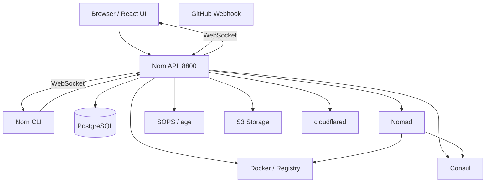

# Architecture Overview

## System Diagram


```mermaid
graph TB
    Browser[Browser / React UI] --> API[Norn API :8800]
    CLI[Norn CLI] --> API
    Webhook[GitHub Webhook] --> API

    API --> DB[(PostgreSQL)]
    API --> Nomad[Nomad]
    API --> Consul[Consul]
    API --> SOPS[SOPS / age]
    API --> S3[S3 Storage]
    API --> Docker[Docker / Registry]
    API --> CF[cloudflared]

    API -- WebSocket --> Browser
    API -- WebSocket --> CLI

    Nomad --> Docker
    Nomad --> Consul
```

## Module Boundaries

Norn v2 is split into three independently built modules:

### API (`v2/api/`)

The Go API server. Handles app discovery, deploy pipeline orchestration, Nomad job management, secrets, and real-time event broadcasting.

```
v2/api/
├── main.go            # Entry point, routing, middleware
├── config/            # Environment-based configuration
├── store/             # PostgreSQL database layer
├── handler/           # HTTP request handlers
├── pipeline/          # Deploy pipeline orchestrator
├── nomad/             # Nomad client and job translator
├── consul/            # Consul client for service discovery
├── hub/               # WebSocket event hub
├── saga/              # Saga event log system
├── secrets/           # SOPS-based secrets manager
├── storage/           # S3-compatible object storage client
├── beacon/            # Beacon event service and notification dispatch
├── auth/              # CF Access JWT validator
└── model/             # Shared types (InfraSpec, Deployment, etc.)
```

### CLI (`v2/cli/`)

The Charm-powered terminal client. Uses Bubble Tea for TUI rendering, Lip Gloss for styling, and Cobra for command structure.

```
v2/cli/
├── main.go
├── cmd/               # Cobra command definitions
│   ├── root.go
│   ├── status.go
│   ├── app.go
│   ├── deploy.go
│   ├── restart.go
│   ├── rollback.go
│   ├── scale.go
│   ├── logs.go
│   ├── health.go
│   ├── stats.go
│   ├── secrets.go
│   ├── snapshots.go
│   ├── cron.go
│   ├── invoke.go
│   ├── saga.go
│   ├── validate.go
│   ├── forge.go
│   ├── resources.go
│   ├── notifications.go
│   ├── canary.go
│   ├── deploy_group.go
│   ├── snapshots_export.go
│   ├── endpoints.go
│   ├── stream.go
│   └── version.go
└── api/               # HTTP client for the Norn API
```

### UI (`v2/ui/`)

React 19 + Vite 7 + TypeScript dashboard. Communicates with the API over REST and WebSocket.

```
v2/ui/
├── src/
│   ├── components/    # React components (AppCard, DeployPanel, etc.)
│   ├── hooks/         # Custom hooks (useWebSocket, useApps, etc.)
│   ├── pages/         # Route pages
│   └── api/           # API client functions
├── index.html
├── vite.config.ts
└── package.json
```

## API Endpoints

### General

| Method | Path | Description |
|--------|------|-------------|
| GET | `/api/health` | Service health check |
| GET | `/metrics` | Prometheus-compatible Norn control-plane metrics |
| GET | `/api/metrics` | Same metrics endpoint under the API prefix |
| GET | `/api/observability/prometheus.yml` | Generated Prometheus scrape config |
| GET | `/api/observability/bundle` | Prometheus, alert, Grafana, and service bundle |
| GET | `/api/observability/alerts.yml` | Prometheus alert rules from the observability bundle |
| POST | `/api/observability/services/install` | Install generated observability app directories into `NORN_APPS_DIR` |
| GET | `/api/secrets/migration-plan` | Value-safe plaintext secret migration plan across apps |
| GET | `/api/version` | API version |
| GET | `/api/stats` | Deployment and cluster statistics |
| GET | `/api/apps` | List all discovered apps |
| GET | `/api/deployments` | List recent deployments |
| GET | `/api/deployments/{id}/steps` | List deployment stage checkpoints |
| GET | `/api/operations` | List recent operation queue rows |
| GET | `/api/operations/active` | List queued/running operations for drains |
| GET | `/api/alerts/rules` | Built-in alert rule catalogue |
| GET | `/api/resources/suggestions` | Resource right-sizing suggestions based on live Nomad allocation stats |
| GET | `/api/events` | List Beacon events |
| GET | `/api/events/{id}` | Beacon event detail |
| POST | `/api/events/{id}/ack` | Acknowledge a Beacon event |
| POST | `/api/events/{id}/snooze` | Snooze a Beacon event |
| POST | `/api/events/{id}/open` | Reopen a Beacon event |
| GET | `/api/validate` | Validate all infraspecs |
| GET | `/api/validate/{id}` | Validate a single infraspec |
| GET | `/api/saga` | List recent saga events |
| GET | `/api/saga/{sagaId}` | Get all events for a saga |
| GET | `/api/cloudflared/ingress` | List active cloudflared hostnames |
| POST | `/api/webhooks/{provider}` | Webhook receiver (GitHub) |
| GET | `/api/webhooks/deliveries` | List recent webhook deliveries |
| POST | `/api/webhooks/deliveries/{id}/replay` | Replay a webhook delivery |
| GET | `/api/platform/releases` | List installed platform releases |
| POST | `/api/platform/releases/{sha}/rollback` | Roll back to a platform release |
| GET | `/api/notifications/channels` | List notification channels |
| POST | `/api/notifications/channels` | Create a notification channel |
| POST | `/api/notifications/channels/{id}/test` | Send a test notification |
| DELETE | `/api/notifications/channels/{id}` | Delete a notification channel |
| GET | `/api/deploy-groups` | List deploy groups |
| POST | `/api/deploy-groups/{name}/deploy` | Deploy a deploy group |

### Per-App (`/api/apps/{id}/...`)

| Method | Path | Description |
|--------|------|-------------|
| GET | `/` | Get app details |
| POST | `/deploy` | Start a deployment |
| GET | `/logs` | Stream logs (SSE) |
| POST | `/restart` | Rolling restart |
| POST | `/scale` | Scale a task group |
| POST | `/rollback` | Rollback to previous deployment |
| GET | `/secrets` | List secret keys |
| PUT | `/secrets` | Update secrets |
| DELETE | `/secrets/{key}` | Delete a secret |
| GET | `/snapshots` | List database snapshots |
| POST | `/snapshots/{ts}/restore` | Restore a snapshot |
| GET | `/cron/history` | Cron execution history |
| POST | `/cron/trigger` | Trigger a cron job manually |
| POST | `/cron/pause` | Pause a cron job |
| POST | `/cron/resume` | Resume a paused cron job |
| PUT | `/cron/schedule` | Update cron schedule |
| POST | `/invoke` | Invoke a function |
| GET | `/function/history` | Function execution history |
| GET | `/canary` | Canary deployment status |
| POST | `/promote` | Promote canary allocations |
| POST | `/snapshots/export` | Export latest snapshot to S3 |
| GET | `/snapshots/remote` | List remote snapshots |
| POST | `/snapshots/import` | Import snapshot from S3 |
| POST | `/forge` | Set up cloudflared routing |
| POST | `/teardown` | Remove cloudflared routing |
| POST | `/endpoints/toggle` | Toggle a single cloudflared endpoint |
| GET | `/exec` | Exec into a running allocation |

### WebSocket

| Path | Description |
|------|-------------|
| `/ws` | Real-time event stream |

## Authentication

Norn supports three auth modes (can be combined):

1. **Cloudflare Access** — validates `Cf-Access-Jwt-Assertion` header against your CF Access team. Set `NORN_CF_ACCESS_TEAM_DOMAIN` and `NORN_CF_ACCESS_AUD`.
2. **Bearer Token** — validates `Authorization: Bearer <token>` header. Set `NORN_API_TOKEN`.
3. **Open** — if neither is configured, all endpoints are open (suitable for local dev).

Auth-exempt routes: `/ws`, `/api/health`, `/api/version`, `/api/webhooks/github`, `/api/webhooks/gitea`, `/api/apps/*/exec`.
