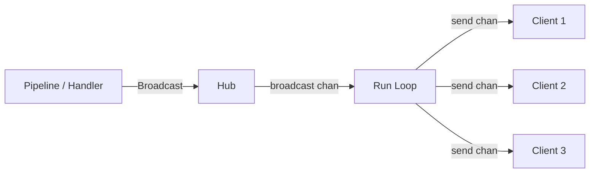

# WebSocket

Norn uses WebSocket for real-time event broadcasting. The dashboard and CLI connect to receive live updates during deploys, restarts, and other operations.

## Connection

```
ws://localhost:8800/ws
```

No authentication is required for WebSocket connections (excluded from auth middleware). Origin checking allows localhost and any origins in `NORN_ALLOWED_ORIGINS`.

## Event Envelope

Every message is a JSON object with this structure:

```json
{
  "type": "deploy.step",
  "appId": "myapp",
  "payload": {
    "step": "build",
    "sagaId": "abc-123",
    "status": "running"
  }
}
```

| Field | Type | Description |
|-------|------|-------------|
| `type` | string | Event type identifier |
| `appId` | string | App this event relates to |
| `payload` | object | Type-specific data |

## Event Types

| Type | Payload Fields | Emitted When |
|------|----------------|--------------|
| `deploy.step` | `step`, `sagaId`, `status` | Pipeline step starts, completes, or fails |
| `deploy.progress` | `sagaId`, `message` | Allocation health polling updates |
| `deploy.completed` | `sagaId`, `imageTag` | Deploy pipeline finished successfully |
| `deploy.failed` | `sagaId`, `error` | Deploy pipeline failed |
| `app.restarted` | `sagaId` | Rolling restart completed |
| `app.scaled` | `sagaId`, `group`, `count` | Task group scaled |
| `function.completed` | `executionId`, `status` | Function invocation finished |

### Step Status Values

The `deploy.step` event's `status` field:

| Status | Meaning |
|--------|---------|
| `running` | Step is currently executing |
| `complete` | Step finished successfully |
| `failed` | Step encountered an error |

## Hub Architecture

The WebSocket hub uses gorilla/websocket and manages connections with a central broadcast loop:



- **Hub.Run()** — goroutine running the main select loop (register, unregister, broadcast)
- **Hub.Broadcast(evt)** — marshals an `Event` to JSON and sends to the broadcast channel
- **Per-client send buffer** — buffered channel (64 messages) prevents slow clients from blocking others
- **Broadcast channel** — buffered at 256 messages
- **Cleanup** — if a client's send buffer is full, the client is disconnected and cleaned up

## Origin Checking

The upgrader checks the `Origin` header:

1. Empty origin → allowed (non-browser clients)
2. Origin in the allowed origins list → allowed
3. Origin hostname is `localhost`, `127.0.0.1`, or `::1` → allowed
4. Otherwise → rejected

Default allowed origins: `http://localhost:5173`, `http://localhost:3000`. Additional origins are configured via `NORN_ALLOWED_ORIGINS` (comma-separated).

## CLI Integration

The CLI connects to the WebSocket during operations like `norn deploy` to render live progress. It uses the Bubble Tea channel pattern:

1. Goroutine connects to WebSocket and reads messages
2. Messages are sent to a Go channel
3. A Bubble Tea command wraps the channel read as `waitForEvent`
4. The TUI model updates on each received event

```go
// Simplified pattern
go func() {
    for {
        _, msg, err := conn.ReadMessage()
        if err != nil { return }
        eventCh <- msg
    }
}()

func waitForEvent(ch chan []byte) tea.Cmd {
    return func() tea.Msg {
        return wsMsg(<-ch)
    }
}
```
