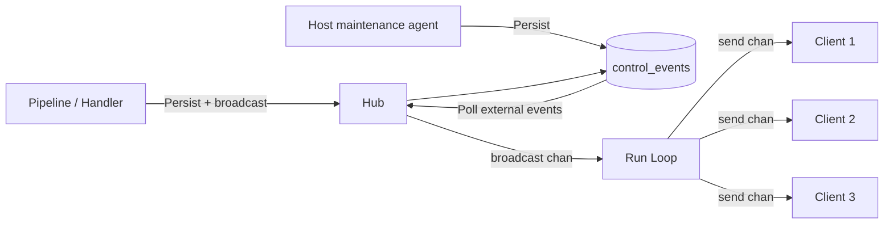

# WebSocket

Norn uses WebSocket for real-time event broadcasting. The dashboard and CLI connect to receive live updates during deploys, restarts, and other operations.

## Connection

```text
ws://localhost:8800/api/v1/events
wss://norn.example.com/api/v1/events
```

`/api/v1/events` is the versioned endpoint. `/ws` remains as a compatibility
alias. When `NORN_API_TOKEN` is configured, connections require either the
control-plane token or an access token carrying `events:read` in the
`Authorization: Bearer` header. Cloudflare Access sessions continue to use the
validated Access cookie/header path. Norn does not accept bearer tokens in URL
query parameters.

Origin checking allows native clients with no `Origin` header, localhost, and
origins in `NORN_ALLOWED_ORIGINS`. The exec WebSocket uses the same origin
policy and requires the separate `apps:exec` scope.

## Event Envelope

Every message is a JSON object with this structure:

```json
{
  "id": 4812,
  "timestamp": "2026-08-07T21:30:00Z",
  "type": "deploy.step",
  "appId": "myapp",
  "payload": {
    "step": "build",
    "sagaId": "abc-123",
    "status": "running"
  }
}
```

| Field | Type | Description |
|-------|------|-------------|
| `id` | integer | Durable monotonic cursor |
| `timestamp` | RFC3339 string | Time the control event was recorded |
| `type` | string | Event type identifier |
| `appId` | string | App this event relates to |
| `payload` | object | Type-specific data |

## Event Types

| Type | Payload Fields | Emitted When |
|------|----------------|--------------|
| `deploy.step` | `step`, `sagaId`, `status` | Pipeline step starts, completes, or fails |
| `deploy.progress` | `sagaId`, `message` | Allocation health polling updates |
| `deploy.completed` | `sagaId`, `imageTag` | Deploy pipeline finished successfully |
| `deploy.failed` | `sagaId`, `error` | Deploy pipeline failed |
| `app.restarted` | `sagaId` | Rolling restart completed |
| `app.scaled` | `sagaId`, `group`, `count` | Task group scaled |
| `function.completed` | `executionId`, `status` | Function invocation finished |
| `maintenance.started` | `operationId`, `kind`, `status` | Host agent claimed a platform or host operation |
| `maintenance.completed` | `operationId`, `kind`, `status` | Maintenance operation succeeded |
| `maintenance.failed` | `operationId`, `kind`, `status`, `message` | Maintenance operation failed |

## Cursor Replay

Events are stored in PostgreSQL before being broadcast. Reconnect with the last
processed event ID to replay missed messages:

```text
wss://norn.example.com/api/v1/events?after=4812
```

Replay is capped at 500 events per connection. If a client receives 500 replay
events, it should reconnect with the last ID until caught up. REST operation
state remains authoritative; the event stream tells clients what changed.

### Step Status Values

The `deploy.step` event's `status` field:

| Status | Meaning |
|--------|---------|
| `running` | Step is currently executing |
| `complete` | Step finished successfully |
| `failed` | Step encountered an error |

## Hub Architecture

The WebSocket hub uses gorilla/websocket and manages connections with a central broadcast loop:


```mermaid
graph LR
    P[Pipeline / Handler] -->|Persist + broadcast| Hub
    A[Host maintenance agent] -->|Persist| DB[(control_events)]
    DB -->|Poll external events| Hub
    Hub --> DB
    Hub -->|broadcast chan| Loop[Run Loop]
    Loop -->|send chan| C1[Client 1]
    Loop -->|send chan| C2[Client 2]
    Loop -->|send chan| C3[Client 3]
```

- **Hub.Run()** — goroutine running the main select loop (register, unregister, broadcast)
- **Hub.Broadcast(evt)** — persists the event, assigns its cursor, and sends it to connected clients
- **External event polling** — relays events written by the independent host agent
- **Per-client send buffer** — buffered channel (64 messages) prevents slow clients from blocking others
- **Broadcast channel** — buffered at 256 messages
- **Cleanup** — if a client's send buffer is full, the client is disconnected and cleaned up

## Origin Checking

The upgrader checks the `Origin` header:

1. Empty origin → allowed (non-browser clients)
2. Origin in the allowed origins list → allowed
3. Origin hostname is `localhost`, `127.0.0.1`, or `::1` → allowed
4. Otherwise → rejected

Default allowed origins: `http://localhost:5173`, `http://localhost:3000`. Additional origins are configured via `NORN_ALLOWED_ORIGINS` (comma-separated).

## CLI Integration

The CLI connects to the WebSocket during operations like `norn deploy` to render live progress. It uses the Bubble Tea channel pattern:

1. Goroutine connects to WebSocket and reads messages
2. Messages are sent to a Go channel
3. A Bubble Tea command wraps the channel read as `waitForEvent`
4. The TUI model updates on each received event

```go
// Simplified pattern
go func() {
    for {
        _, msg, err := conn.ReadMessage()
        if err != nil { return }
        eventCh <- msg
    }
}()

func waitForEvent(ch chan []byte) tea.Cmd {
    return func() tea.Msg {
        return wsMsg(<-ch)
    }
}
```
