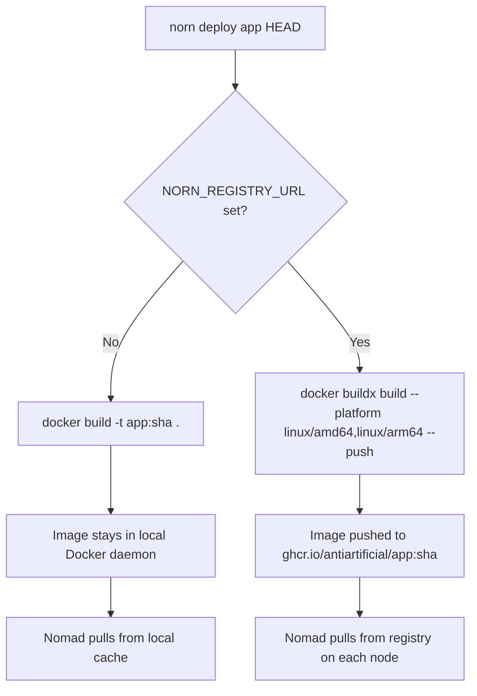

# Dev Environment

Norn v2 supports two local modes for development, with different trade-offs around build speed, multi-node testing, and port accessibility.

## Dev Mode

Single-node, local-only. Fastest iteration cycle.

```bash
cd norn/v2
make up      # starts consul, nomad, api in background
make logs    # tail all logs
make down    # stop everything
```

**Characteristics:**
- Nomad runs in `-dev` mode (in-memory state, no persistence across restarts)
- Consul runs in `-dev` mode
- API runs without `NORN_REGISTRY_URL` — local Docker builds only
- All ports bind to `127.0.0.1` (accessible via `localhost`)
- No sudo required
- Deploys take ~1-2 minutes (local `docker build`)

**When to use:** Day-to-day development, testing infraspec changes, debugging pipeline issues.

## Federated Mode

Multi-node, simulates production. Uses real Nomad/Consul persistence and Tailscale for cross-node communication.

```bash
cd norn/v2
make up-fed  # starts consul server, nomad server (sudo), api
```

**Characteristics:**
- Nomad runs as a real server+client with persistent state in `/tmp/nomad-server`
- Consul runs as a real server with persistent state in `/tmp/consul-server`
- Both advertise on the Tailscale IP (`100.89.46.50`) for cluster joins
- API runs with `NORN_REGISTRY_URL=ghcr.io/antiartificial` — multi-arch builds + registry push
- Ports bind to the advertise IP (not localhost)
- Nomad requires sudo (for Docker volume mounts on Linux workers)
- Deploys take ~5-10 minutes (buildx multi-arch + push + pull)

**When to use:** Testing multi-node scheduling, DO worker integration, verifying multi-arch builds, pre-production validation.

## Build Pipeline: Local vs Registry

The `NORN_REGISTRY_URL` environment variable controls the build strategy:



### Local builds (dev mode)

```
NORN_REGISTRY_URL not set
→ docker build -t mail-indexer:0af44c8a .
→ image tag: mail-indexer:0af44c8a
→ available immediately on local Docker daemon
→ ~30s for Go apps, ~60s for React+nginx
```

### Registry builds (federated mode)

```
NORN_REGISTRY_URL=ghcr.io/antiartificial
→ docker buildx build --platform linux/amd64,linux/arm64 -t ghcr.io/antiartificial/mail-indexer:0af44c8a --push .
→ image tag: ghcr.io/antiartificial/mail-indexer:0af44c8a
→ pushed to registry, pulled by each Nomad node
→ ~3-5 min (compile x2 architectures + network transfer)
```

**Why multi-arch?** When worker nodes run different architectures (e.g., Apple Silicon Mac + AMD64 DO droplet), the same image must work on both. `buildx` compiles for both platforms in one build.

**Why is it slower?** Two compilations instead of one, plus the push/pull round-trip to the container registry. The registry also requires authentication — Nomad's Docker driver doesn't use Docker Desktop's credential store, so images must be pre-pulled or the registry must be public.

## Port Binding

### Dev mode

All Nomad containers bind to `127.0.0.1`:

| Service | Port | Access |
|---------|------|--------|
| signal-sideband | 3001 | `http://localhost:3001` |
| mail-agent | 80 | `http://localhost:80` |
| mail-indexer | 8090 | `http://localhost:8090` |
| signal-cli | 8080 | `http://localhost:8080` |
| gitea | dynamic | `http://localhost:{port}` |
| Nomad UI | 4646 | `http://localhost:4646/ui` |
| Consul UI | 8500 | `http://localhost:8500/ui` |
| Norn API | 8800 | `http://localhost:8800` |

Apps with `endpoints` in their infraspec get static ports. Apps without endpoints get dynamic ports that change on restart.

### Federated mode

Nomad containers bind to the advertise IP (e.g., `100.89.46.50` or the node's Tailscale address). Ports are accessible from other nodes on the Tailnet but not via `localhost`.

## Inter-Container Communication

Docker containers in Nomad use bridge networking by default. To reach the host (e.g., PostgreSQL via Postgres.app), use:

| Context | Address |
|---------|---------|
| macOS Docker Desktop | `host.docker.internal` |
| Linux (DO worker) | `172.17.0.1` (Docker bridge gateway) or Tailscale IP |

For container-to-container communication (e.g., nginx proxying to a backend), use `host.docker.internal:{static_port}` since both containers can reach the host where Nomad maps the ports.

## Host Volumes

Host volumes must be declared in the Nomad config. Dev mode uses `dev/nomad-dev.hcl`:

```hcl
client {
  host_volume "gitea-data" {
    path      = "/Users/0xadb/volumes/gitea-data"
    read_only = false
  }
}
```

To add a new volume:
1. Create the host directory: `mkdir -p ~/volumes/my-data`
2. Add the `host_volume` block to `dev/nomad-dev.hcl` (and `dev/nomad-server.hcl` for federated mode)
3. Restart Nomad (`make down && make up`)
4. Reference in infraspec:
   ```yaml
   volumes:
     - name: my-data
       mount: /data
   ```

## Federation: Adding Worker Nodes

When you need multi-node scheduling (e.g., a DigitalOcean droplet):

1. Install Nomad and Docker on the worker
2. Install Tailscale and join the tailnet
3. Create a Nomad client config:
   ```hcl
   client {
     enabled = true
     servers = ["100.89.46.50:4647"]  # server's Tailscale IP
   }
   ```
4. Start Nomad: `nomad agent -config client.hcl`
5. Switch to federated mode locally (`make up-fed`)
6. Set `NORN_REGISTRY_URL` so images are pushed to a registry the worker can pull from
7. Deploy — Nomad will schedule across both nodes

**Requirements for federation:**
- `NORN_REGISTRY_URL` must be set (workers need to pull images from a shared registry)
- Registry must be accessible from all nodes (or images pre-pulled)
- Host volumes only exist on the node where they're created — jobs with volumes are constrained to those nodes
- Advertise IPs must be routable between nodes (Tailscale handles this)
