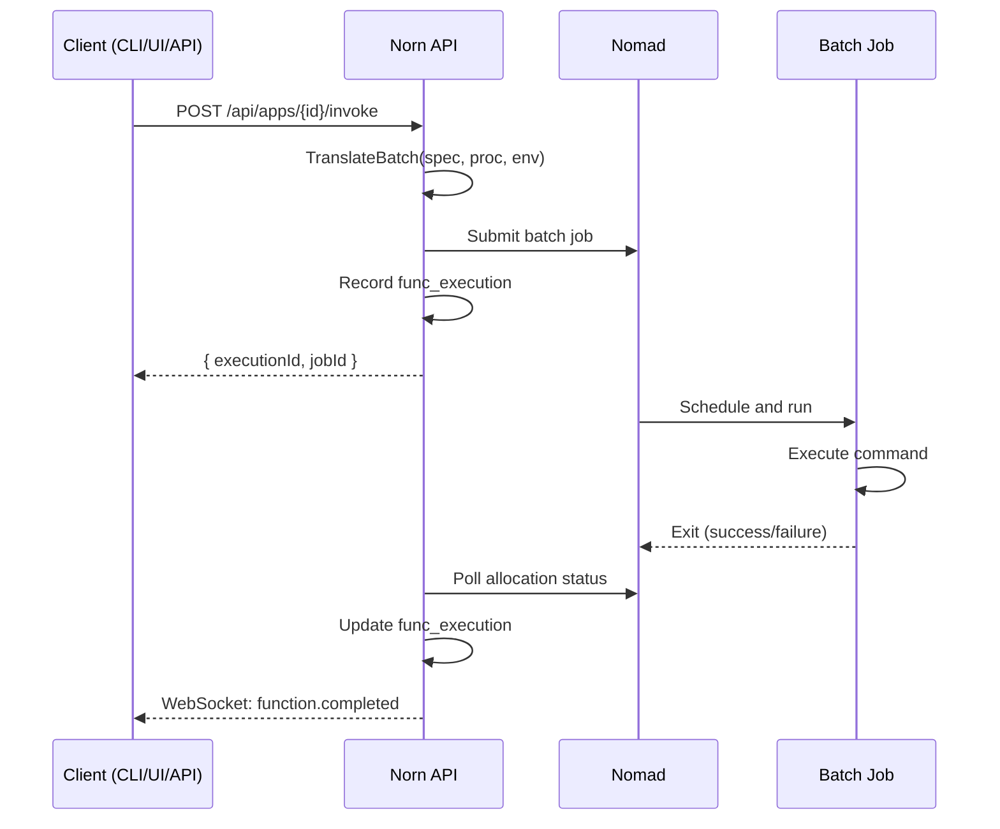

# Functions

Functions are HTTP-triggered ephemeral containers. Define a process with a `function` spec, invoke it via API/CLI/UI, and Norn runs a one-shot Nomad batch job.

## Defining a Function

Add a process with a `function` block to your infraspec:

```yaml
processes:
  resize:
    command: ./resize
    function:
      timeout: 60s
      memory: 512
```

The `function` field makes this a batch process. It won't run as a long-lived service — it only executes when invoked.

## Invocation Flow



## Environment Variables

When a function is invoked, Norn injects these environment variables into the batch job in addition to the app's standard env and secrets:

| Variable | Description |
|----------|-------------|
| `NORN_REQUEST_BODY` | The JSON request body passed to `--body` |
| `NORN_REQUEST_METHOD` | HTTP method (always `POST`) |
| `NORN_REQUEST_PATH` | The invocation path |

## CLI Usage

```bash
# Basic invocation
norn invoke myapp --process=resize --body='{"url": "https://example.com/image.jpg"}'

# Load body from a file
norn invoke myapp --process=resize --body=@input.json
```

Flags:

| Flag | Description |
|------|-------------|
| `--process`, `-p` | Process name to invoke (required) |
| `--body`, `-b` | JSON request body or `@file` to read from file |

## API Usage

```bash
curl -X POST http://localhost:8800/api/apps/myapp/invoke \
  -H "Content-Type: application/json" \
  -d '{"process": "resize", "body": {"url": "https://example.com/image.jpg"}}'
```

Response:

```json
{
  "executionId": "abc-123",
  "jobId": "myapp-resize-abc123"
}
```

## Execution History

View past invocations:

```bash
# CLI — not yet a dedicated command; use the UI or API
curl http://localhost:8800/api/apps/myapp/function/history
```

The UI shows a FunctionPanel with an invoke form and scrollable execution history table.

## Resource Overrides

The `function.memory` field overrides `resources.memory` for the batch job. This lets you keep the default resource profile low for service processes while allowing functions to burst higher:

```yaml
processes:
  web:
    port: 3000
    resources:
      cpu: 100
      memory: 128
  heavy-compute:
    command: ./compute
    function:
      timeout: 5m
      memory: 2048
    resources:
      cpu: 500
```
