# Fleet GitOps

Norn fleet management deliberately has two owners:

| Concern | Owner |
|---|---|
| Desired pools, provider, region, and VM size | private `norn-fleet` repository |
| VPC, load balancer, firewall, and VMs | OpenTofu in the infrastructure runner |
| Provider credentials and apply authorization | GitHub environment / runner configuration |
| Node enrollment, Nomad/Consul health, drain, and assurance | Norn |
| Application allocations | Norn and Nomad |
| Visibility, planning, audit receipts | Norn API, CLI, web, and native clients |

There is no `norn-fleet` daemon in v1. The infrastructure repository is desired state; the existing Norn application is the operator experience.

## Five-minute start

Clone the private infrastructure repository and run its secret-safe assistant:

```sh
git clone git@github.com:YOUR-ORG/norn-fleet.git
cd norn-fleet
./scripts/setup
./scripts/setup doctor
```

The assistant verifies OpenTofu, GitHub branch protection, protected
environments, configured secret *names*, the fleet document, and the local
contract. It can upload values to GitHub over stdin, but never prints them or
places them in process arguments. The required inputs are:

- a private GitHub repository and an administrator authenticated with `repo`
  and `workflow` scopes;
- a DigitalOcean token scoped to the VPC, Droplet, load-balancer, firewall,
  tag, and referenced SSH-key operations used by the module;
- versioned S3-compatible state storage and a key with bucket
  list/read/write/delete access;
- SSH fingerprints, administrator CIDRs, and reviewed cloud-init;
- a trusted HTTPS Norn endpoint and runner token with `api:read` and
  `fleet:operate` (`api:write` remains a temporary compatibility superset); and
- checked-in idempotent configuration, enrollment, and readiness hook commands.

Norn can do the schema validation, durable planning, fleet inventory,
enrollment/readiness observation, checkpointing, and operator presentation.
The one-time provider/state/bootstrap credential setup remains in the protected
runner because moving it into Norn would make the control plane a cloud root.
The repository's `docs/getting-started.md` is the copy/paste guide for both
interactive and environment-driven setup.

Point the Norn server at a read-only checkout and verify the handoff:

```sh
NORN_FLEET_CONFIG=/srv/norn-fleet/environments/production/nyc3/cluster.yaml
norn fleet validate environments/production/nyc3/cluster.yaml
norn fleet pools
```

### Repository-scoped GitHub App

Norn can open the reviewed infrastructure pull request and dispatch the
protected apply without holding a personal token. Create a GitHub App with
repository permissions **Actions: write**, **Contents: write**, **Pull
requests: write**, and the automatic **Metadata: read** permission. Install it
only on the private `norn-fleet` repository, generate a private key, keep that
file mode `0600`, and configure:

```sh
NORN_FLEET_GITHUB_APP_ID=123456
NORN_FLEET_GITHUB_INSTALLATION_ID=789012
NORN_FLEET_GITHUB_PRIVATE_KEY_FILE=/etc/norn/fleet-github-app.pem
NORN_FLEET_GITHUB_REPOSITORY=YOUR-ORG/norn-fleet
NORN_FLEET_GITHUB_CONFIG_PATH=environments/production/nyc3/cluster.yaml
NORN_FLEET_GITHUB_DEFAULT_BRANCH=main
NORN_FLEET_GITHUB_PLAN_WORKFLOW=plan.yml
NORN_FLEET_GITHUB_APPLY_WORKFLOW=apply.yml
```

The private key never leaves the Norn server. Norn signs a short-lived App JWT,
requests a one-hour installation token narrowed to that repository and the
permissions needed for the current action, and holds neither token durably.
DigitalOcean, state, SSH, cloud-init, and Norn runner credentials remain only
in protected GitHub environments.

The `norn-fleet` assistant can validate the IDs, repository, cluster path, and
private-key permissions and write a `0600` environment fragment:

```sh
./scripts/setup github-app \
  --app-id 123456 \
  --installation-id 789012 \
  --private-key-file /etc/norn/fleet-github-app.pem \
  --output ./private/norn-fleet-github.env
norn fleet github status
```



```mermaid
flowchart LR
  Operator --> Norn[Norn Fleet API / CLI / UI]
  Norn --> Receipt[Durable capacity plan]
  Receipt --> PR[norn-fleet pull request]
  PR --> Plan[OpenTofu plan]
  Plan --> Review[Git review and configured apply gate]
  Review --> Apply[OpenTofu apply]
  Apply --> Nodes[Cloud nodes]
  Nodes --> Enroll[Norn enrollment and assurance]
  Enroll --> Drain[Drain replaced nodes]
```

Norn never receives a DigitalOcean token and the plan API never mutates provider state.

## Fleet document

Each environment/region has a pinned document:

```yaml
apiVersion: norn.dev/fleet/v1
kind: Cluster
metadata:
  repository: antiartificial/norn-fleet
  environment: production
  workflowURL: https://github.com/antiartificial/norn-fleet/actions/workflows/apply.yml
cluster:
  name: production-nyc3
  provider: digitalocean
  region: nyc3
nodePools:
  app:
    size: s-4vcpu-8gb
    min: 2
    desired: 2
    max: 8
    labels: { workload: app }
    replacement:
      strategy: blueGreen
      requireCapacityHeadroom: true
      drainTimeout: 15m
      requireReadiness: true
```

Configure the Norn server with a read-only checkout:

```sh
NORN_FLEET_CONFIG=/srv/norn-fleet/environments/production/nyc3/cluster.yaml
```

The API returns `configured: false` when this is absent. That is a supported development state, not permission to infer infrastructure from Nomad.

## Validation

Validation is strict: unknown YAML fields, multiple YAML documents, unsafe quorum, invalid capacity ordering, missing blue/green headroom/readiness, weak ingress redundancy, and invalid drain windows produce stable finding codes.

```sh
norn fleet validate environments/production/nyc3/cluster.yaml
norn validate --file ./infraspec.yaml --fleet environments/production/nyc3/cluster.yaml
```

The API equivalents are:

| Method | Route | Behavior |
|---|---|---|
| `POST` | `/api/v1/fleet/validate` | Strict fleet schema and sanity report |
| `POST` | `/api/v1/validate/infraspec` | Strict uploaded InfraSpec; optional `fleetDocument` cross-check |
| `GET` | `/api/v1/fleet/node-pools` | Desired pool inventory and config digest |
| `GET`, `POST` | `/api/v1/fleet/plans/{planID}/reconciliations` | List or append plan/commit/state/evidence-bound recovery checkpoints |
| `GET`, `POST` | `/api/v1/fleet/plans/{planID}/attempts` | List or start numbered, reviewed-input-bound protected-runner attempts |
| `GET` | `/api/v1/fleet/plans/{planID}/attempts/{attemptID}` | Read one attempt and derive heartbeat expiry without touching unrelated plans |
| `POST` | `/api/v1/fleet/plans/{planID}/attempts/{attemptID}/heartbeat` | Record monotonic liveness for the exact current phase |
| `POST` | `/api/v1/fleet/plans/{planID}/attempts/{attemptID}/advance` | Advance only after successful proof bound to that attempt and phase |
| `POST` | `/api/v1/fleet/plans/{planID}/attempts/{attemptID}/retry` | Create the next numbered attempt from failed, canceled, or abandoned work |
| `POST` | `/api/v1/fleet/plans/{planID}/attempts/{attemptID}/cancel` | Cancel Norn's live-attempt record at an exact revision; the runner must stop its external process |
| `GET` | `/api/v1/fleet/github` | Value-safe GitHub App installation status |
| `POST` | `/api/v1/fleet/plans/{planID}/github/pull-request` | Create or recover the deterministic reviewed PR |
| `POST` | `/api/v1/fleet/plans/{planID}/github/dispatch` | Discover the merged SHA-bound plan artifact and create or recover protected apply |

An invalid document returns HTTP 200 with `valid: false`; malformed request envelopes use `application/problem+json`. This makes validation deterministic for UI and CI clients without treating user-authored validation findings as transport failures.

## Capacity plans

```sh
norn fleet pools
norn fleet plan app --desired 4 --reason "launch headroom"
norn fleet replace app --size s-8vcpu-16gb --reason "memory pressure"
norn fleet reconcile app
norn fleet github status
norn fleet github pr PLAN_UUID
norn fleet github apply PLAN_UUID
```

Protected runner automation uses the dedicated attempt protocol:

```sh
norn fleet attempt start PLAN_UUID --runner-id "$GITHUB_RUN_ID-$GITHUB_RUN_ATTEMPT" --commit "$GITHUB_SHA" --plan-sha256 "$PLAN_SHA256"
norn fleet attempt heartbeat PLAN_UUID ATTEMPT_UUID --phase infrastructure_applied --sequence 1 --revision 1
# record the successful, attempt-bound reconciliation checkpoint
norn fleet attempt advance PLAN_UUID ATTEMPT_UUID --phase infrastructure_applied --revision 2
norn fleet attempts PLAN_UUID
```

The runner must refresh the revision after every transition. An idempotent
replay may return the already-recorded result, but changing any reviewed binding
under the same external runner ID returns a conflict. Norn permits only one
queued/running attempt per plan. Once a plan has attempt history, subsequent
executions must use `retry`, preserving provenance rather than starting an
unrelated attempt.

The protected `norn-fleet` apply and recovery workflows start or resume this
attempt before provider mutation. They heartbeat while OpenTofu and lifecycle
hooks run, fail closed if Norn cannot accept liveness evidence, and resume at
the first phase without a successful checkpoint. Runner-local state is mode
`0600`, contains no bearer token, and is disposable because Norn is the durable
authority.

With the GitHub App configured, create the durable plan before any repository
edit. Norn then creates the source-digest-bound branch and pull request:

```sh
norn fleet plan app --desired 4 --reason "launch headroom"
norn fleet github pr PLAN_UUID
# review and merge; wait for the main-branch plan workflow
norn fleet github apply PLAN_UUID
```

For a downsize, both the capacity plan and apply dispatch require explicit
destructive intent:

```sh
norn fleet plan app --desired 2 --reason "traffic returned to baseline"
norn fleet github pr PLAN_UUID
# review and merge; wait for the main-branch plan workflow
norn fleet github apply PLAN_UUID --allow-destructive
```

The staged contraction lane binds exact droplet addresses to current node IDs,
proves the remaining capacity, reruns configuration/enrollment/readiness hooks,
drains the selected nodes, and only then consumes the reviewed deletion.
Reissuing either GitHub command recovers the deterministic pull request or
existing workflow run instead of creating a duplicate.

`./scripts/setup scale` remains available as a repository-only manual fallback.
For that path, create the Norn capacity plan from unchanged `main` first and
preserve the plan UUID in the review; do not edit the checkout Norn reads before
planning.

`POST /api/v1/fleet/node-pools/{pool}/plan` records a terminal `fleet.capacity-plan` operation. Its typed receipt binds the plan ID, cluster, pool, action, source-document digest, plan digest, and workflow URL; production receipts also include an HMAC signature. Production requires `NORN_AUDIT_SIGNING_KEY`; development plans remain durable but carry an explicit unsigned warning.

Planning safety in v1:

- desired capacity must remain within declared min/max;
- VM-size changes require `blueGreen`;
- downsize plans require live reservation, rollout overlap, one-node-failure headroom, pending-allocation, volume, long-connection, and singleton evidence at approval time;
- no plan applies Terraform or calls a provider;
- the infrastructure runner must check out an immutable reviewed SHA and record the Norn plan ID.

GitHub's current private-repository plan does not provide environment required reviewers. The private `norn-fleet` repository therefore restricts both secret-bearing environments to protected branches, requires pull requests and the strict `contract` check on `main`, binds apply to the reviewed current-main plan artifact, and requires a separate manual dispatch. With one operator, repository write access remains production access; require an independent approval before granting another person write access. This repository policy is not an active Norn control-plane guarantee.

The GitHub App improves authentication and recovery, not authorization policy:
the PR must still merge through protected `main`, the plan workflow must succeed
for that merge commit, and the apply environment remains the provider-credential
boundary. Norn derives the plan run ID and SHA from the protected artifact. The
apply workflow's plan-specific run name makes a dropped dispatch response
recoverable after a Norn restart.

## Fleet operator view

The web and native Fleet views reconstruct provisioning from server evidence;
they do not keep a client-only wizard state. Expanding a plan shows:

- the capacity-plan receipt, repository review receipt, and protected apply
  dispatch receipt;
- every canonical reconciliation phase as proven, pending, failed, or blocked;
- the latest numbered runner attempt, exact current phase, heartbeat deadline,
  optimistic revision, retry ancestry, and terminal state;
- the next expected phase and only the safe action supported by the current
  contract, such as creating or recovering the pull request, dispatching the
  reviewed apply, or opening the protected runner;
- current application health, active allocations, operations, regional deploy
  state, and a desired-plus-observed topology from ingress through regions,
  pools, workloads, allocations, and declared dependencies.

The topology deliberately distinguishes its sources. Regions and pools come
from the read-only fleet document. Workloads, allocations, and health come from
Norn runtime observations. Service-manifest placement tags bind an allocation
ID to its region and node pool; exact graph edges appear only when all three
values are observed and marked verified. Provider VM identity and enrollment
state are not invented when the API does not expose them. The graph has a text
equivalent, keyboard-focusable nodes, and disables path and status animation
for reduced motion.

A successful `fleet.github.apply-dispatch` receipt proves that the protected
workflow was handed off; it does **not** prove that Terraform is currently
executing. The runner must register a durable attempt before mutation and send
monotonic heartbeats while it owns the current phase. Norn marks a phase active
only while that attempt is `queued` or `running`; a missed deadline durably
transitions it to `abandoned`. A phase advances only after a successful
reconciliation checkpoint bound to the same attempt, reviewed commit, and plan
digest. Failed or abandoned work creates a new numbered attempt through the
retry transition and never rewrites prior evidence.

Authenticated `/api/v1/capabilities` includes the connected principal's
effective scopes. Web and native clients hide or disable Fleet mutations
without `fleet:operate`, `api:write`, or `admin`, but the server remains the
final authorization boundary.

## Replacement lifecycle

For non-destructive plans, the runner registers its reviewed commit and plan
digest before provider mutation. Each heartbeat carries the current phase,
monotonic sequence, and optimistic revision. A failed, canceled, timed-out, or
manually selected apply run is replanned under the remote state lock; recovery
proceeds only when every remaining action is a non-destructive subset of the
originally reviewed plan. Configuration, enrollment, and assurance hooks are
idempotent, and the replacement runner uses retry ancestry plus append-only
checkpoints to resume at the last proven phase.

The initial hands-off lane deliberately refuses plans containing deletes or same-address replacements. `create_before_destroy` alone cannot prove that a new node enrolled and became ready before OpenTofu removes its predecessor. Destructive blue/green work therefore remains supervised until a staged executor can retain both generations, prove readiness, drain the old generation, and only then consume the reviewed deletion approval. This fail-closed boundary is part of the API/workflow contract, not an operator convention.

Reconciliation phases are `infrastructure_applied`, `inventory_generated`, `nodes_configured`, `nodes_enrolled`, `readiness_verified`, optional `old_nodes_drained`, and `complete`. The API rejects out-of-order success, binding changes, missing drain proof for replacement/downsize plans, invalid state serials, and idempotency-key reuse with different evidence.

Rolling replacement remains an explicit alternative for operators who accept reduced headroom. It is never selected automatically for a size change.

## Migration and exit

Adoption does not move application definitions into Terraform. Add logical `placement.nodePool` references, import or declare existing nodes in the fleet repository, and let Norn observe them. To migrate away, stop fleet applies, drain workloads through Nomad, export state, move the same provider resources to another OpenTofu/Terraform root, and schedule applications elsewhere. Norn does not hide cloud resources behind a proprietary daemon.

Reactive autoscaling can later add a narrowly scoped `norn-fleet-controller` that consumes approved plans with short-lived credentials. That is intentionally outside the v1 trust boundary.
