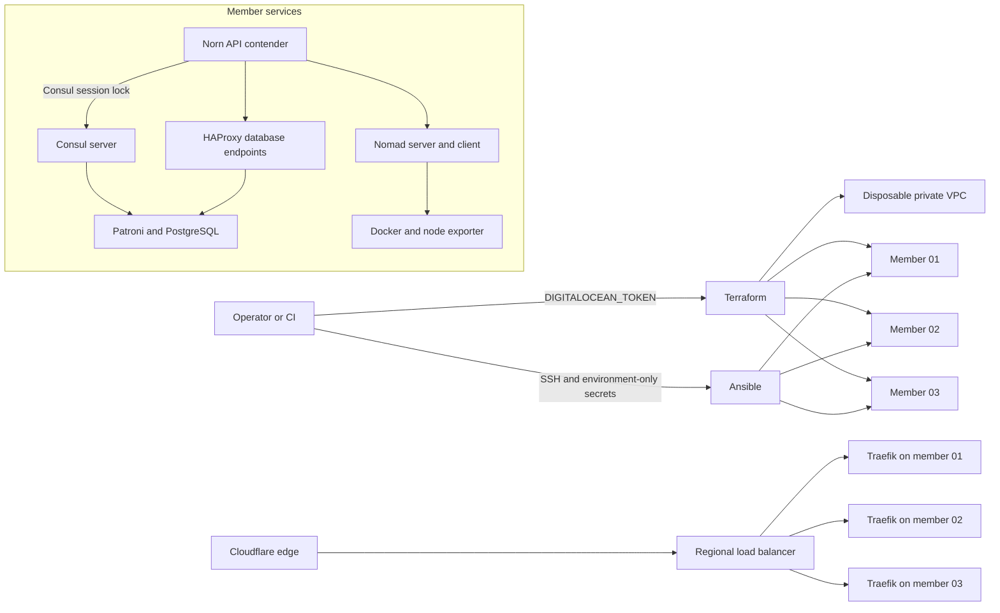

# Linux HA acceptance lab

The DigitalOcean lab is Norn's repeatable proof environment for Linux
scheduling, quorum behavior, PostgreSQL failover/PITR, immutable deployment,
rollback, audit persistence, and node replacement. It is not a second
production environment and it does not reuse the original single-node smoke
droplet.

Source and operator commands live in `v2/infra/ha-lab`. The older root
`infra/terraform` provisions a k3s-oriented multi-cloud experiment and must not
be used for Norn v2 HA.

## Topology and flow



The economical three-member `s-2vcpu-4gb` layout historically cost about
US$72/month. The durability pilot requires `s-4vcpu-8gb` or larger; on August
26, 2026 those three members cost US$144/month or US$0.21429/hour before the
regional load balancer and network usage. Terraform now queries the selected
size during planning, rejects a size unavailable in the requested region, and
outputs its live aggregate Droplet price. Production should separate database,
Consul/Nomad server, and workload-client failure domains.

## Reproducible provisioning contract

| Layer | Owns | Must not contain |
|---|---|---|
| Terraform | VPC, droplets, firewall, project, tags, outputs | API tokens, gossip keys, database passwords, registry credentials |
| cloud-init | Python/bootstrap packages, SSH hardening, lab marker | Any reusable credential or application configuration |
| Ansible | Pinned packages, rendered service config, rolling convergence, health gates | Provider credentials or secrets committed to Git |
| controller secret file | Gossip and database credentials, mode `0600` | Terraform state or cloud-init copies |
| acceptance scripts | Fault injection, assertions, value-safe evidence | Unbounded logs in Norn audit receipts |

Terraform requires an owner and expiry date and rejects public SSH access from
`0.0.0.0/0`. All control/data ports are private-VPC-only. A project-local,
ignored tool bootstrap installs checksum-verified Terraform and an isolated
Ansible environment, so the workflow does not depend on Homebrew or the Mac's
Xcode Command Line Tools.

Terraform state uses the private versioned lab Space through the S3 backend and
`use_lockfile`; credentials come from the selected controller secret file and
are never written to backend HCL. A mode-`0600` local state backup is retained
when migrating. Apply from one serialized pipeline; require plan review and
policy checks. `scripts/lab expiry check` provides the bounded janitor signal,
while destruction still requires an explicit reviewed plan and
`--confirm-disposable-lab`. Do not put a Tailscale auth key in Terraform
variables: mint a short-lived tagged key just in time, enroll through a no-log
Ansible task, and revoke it after convergence.

## Acceptance matrix

| Scenario | Pass condition | Evidence |
|---|---|---|
| Clean-room apply | Three hosts created in the dedicated VPC/firewall/project | Reviewed Terraform plan and resource IDs |
| Idempotent converge | Second Ansible run has no unexpected changes | Play recap |
| Reboot recovery | Services auto-start and all three quorums reform | Consul members, Nomad raft peers, Patroni topology |
| PostgreSQL lifecycle | Norn migrations plus durable audit/drill integration tests pass through HAProxy | `scripts/lab verify` log |
| Primary failure | A different Patroni primary accepts writes; old primary rejoins | `scripts/lab failover` value-safe receipt |
| PITR boundary | Isolated restore contains before-target row and excludes after-target row | `scripts/lab pitr` value-safe receipt |
| Nomad leader loss | Allocations remain healthy and a different raft leader is elected | Nomad peer/allocation output |
| Consul leader loss | Catalog/health remain available and a different leader is elected | Consul raft/health output |
| Immutable deploy | Registry digest is resolved and SBOM/provenance integration test passes | Image digest plus attestation references |
| Regional ingress | Cloudflare request crosses the regional load balancer and Traefik reaches every passing allocation | CF-Ray, unique trace ID in Traefik JSON logs, allocation IDs, Prometheus counter |
| Rollback | Prior digest is resubmitted and app/database checks pass | Norn `artifact.rollback` drill receipt |
| Audit durability | Mutation receipts persist and verify after API restart/leader change | Audit receipt IDs and integrity result |
| Node replacement | Destroy one member only, recreate/converge it, restore quorum | Before/after membership IDs |
| Off-host PITR | Restore succeeds in isolation with the source data directory unavailable, using a versioned object repository | Object version/checksum, measured RTO/RPO |
| Teardown | Saved destroy plan removes only resources with the lab prefix/state | Terraform apply receipt and empty project |

The local-archive PITR drill and failover drill are separate by design. Passing
one does not imply the other, and neither implies regional/off-account backup
durability.

## Executed acceptance result — August 22–23, 2026

The disposable `norn-ha-eval` project was provisioned from this directory in
DigitalOcean Toronto with three 2 vCPU/4 GB Ubuntu members. The following
checks passed against the live hosts:

| Check | Result | Scope proved |
|---|---|---|
| Terraform apply and drift plan | Passed; post-convergence plan reported no changes | Provider resources match reviewed state |
| Ansible convergence | Passed; repeated run produced no unexpected service/configuration changes | Package/configuration automation is repeatable |
| Consul, Nomad, Patroni quorum | Passed with three voting/healthy members | Linux discovery, scheduling, and database consensus mechanics |
| Norn PostgreSQL integration | Passed migrations, production-evidence lifecycle, and exec-authorization lifecycle through HAProxy | Norn's durable tables work on the HA endpoint |
| PostgreSQL failover | Passed; a different primary accepted the post-failure write and the old primary rejoined streaming | Automatic primary election and application write continuity |
| Timestamp PITR | Passed; isolated restore retained one before-target row and excluded the after-target row | Base backup, WAL archive, and exact recovery boundary mechanics |
| Immutable rollout and rollback | Passed `v1` digest → `v2` digest → prior `v1` digest with two healthy allocations | Real-registry digest deployment and rollback behavior |
| Supply-chain output | Passed with BuildKit SBOM and maximum-provenance attestations for both images | Attestation generation, not signature or vulnerability approval |
| Machine restart | Passed one member at a time with quorums and both toy allocations restored | systemd/bootstrap recovery for the substrate and workload |
| Norn API failover and audit | Passed in development from member 01 to member 03, then in the final production profile from member 01 to member 02, with exactly one passing API, a shared recovery receipt, and verified HMAC mutation receipts | Active/passive control API continuity and shared audit persistence |
| Durable drill ledger | Passed live `database.restore`, `artifact.rollback`, and `node.failover` receipts, each opened before its exercise and completed afterward | The readiness drill gate is satisfied by bounded, signed control mutations |
| Member replacement | Passed by destroying/recreating member 03; cloud-init and Ansible restored all services, three raft/database members, zero-lag streaming, and workload health | A clean Linux host can rejoin from declared infrastructure and runtime configuration |
| Off-host PITR | Passed from pgBackRest full backup `20260823-004438F`; isolated restore retained the before-target row and excluded the after-target row | Private versioned Space, WAL continuity, and recovery after leaving the source data directory |
| Artifact admission | Passed real Cosign verification with `norn.git.sha`, transparency-log evidence, and Trivy HIGH/CRITICAL count of zero | Publisher/source binding and vulnerability policy against the actual private-registry digest |
| Replicated deploy catalog | Passed private Git clone, read-only deploy key, SOPS/age decryption, two-allocation deploy, controller failover, then another deploy from member 03 | A promoted controller has the source, secret, and registry inputs needed to deploy |
| Observability | Passed three Prometheus/Grafana/cAdvisor sets; Prometheus observed the toy request counter after both allocations wrote PostgreSQL | Private per-node metrics and the dashboard request signal |
| Audit export | Passed a 22-event, checksum-verified JSON export plus SHA-256 sidecar to distinct versioned Space objects | Off-host audit copy; versioning, not WORM/object lock |
| PostgreSQL TLS | Passed `verify-full` through the local HAProxy name with TLS 1.3/AES-256-GCM; toy allocations redeployed with encrypted DB transport | Verified Norn server identity and encrypted application/VPC traffic |
| Terraform backend | Passed remote state read, lockfile-enabled plan, and zero-drift refresh | Versioned off-host state and serialized mutation protection |
| Consul TLS and ACL | Passed unique node certificates, verified HTTPS/internal RPC, default-deny ACLs, scoped agent/Norn/Patroni/Nomad/observability tokens, and three synchronized raft peers | Encrypted discovery traffic and least-privilege client access survive rolling activation |
| Nomad TLS, ACL, and workload identity | Passed verified HTTPS, mutually authenticated RPC, ACL bootstrap, scoped Norn/observability tokens, and Consul JWT workload identity through the HA JWKS service | Encrypted scheduler traffic and workload-to-Consul identity exchange |
| Control-plane leader failover | Passed Consul member 02 → 03 and Nomad member 03 → 02; both former leaders rejoined, two toy allocations remained running, and exactly one Norn API remained passing | Scheduler/discovery quorum and controller continuity under elected-leader loss |
| Production profile | Passed guarded activation only after the sole blocker was `profile.production`; final report was 25 pass, zero fail, one warning | Live substrate admission is enabled and fail-closed for critical mutations |
| Regional ingress and Cloudflare edge | Passed a proxied Cloudflare A record through the active DO regional load balancer to three Traefik system allocations and two database-backed toy allocations; both HTTP and HTTPS returned 200, trace IDs were present in Traefik JSON access logs, and Prometheus observed the request counter | Stable regional origin, Consul-catalog discovery, hostname routing, multi-allocation balancing, and edge-to-region request flow |
| Transactional durability pilot | Passed two web allocations plus one worker with PostgreSQL outbox/idempotency, test-only Valkey/Redpanda, public LB smoke, recovery faults, distinct-digest rollback, and production signature/vulnerability admission | Application durability and regional workload recovery; not cache/broker HA |

The audit drill exposed and fixed a PostgreSQL precision defect: receipts were
originally signed with nanosecond timestamps, while `timestamptz` preserves
microseconds. Norn now canonicalizes timestamps to database precision and has a
regression test for the round trip.

The replacement drill exposed a stale Nomad client identity for the destroyed
machine. Guarded convergence now purges only a `down` identity whose name is
also represented by a ready inventory member, and a second reconciliation run
completed with zero changes.

The security cutover exposed three issues that the plaintext lane could not
exercise: Consul needs an outbound-TLS phase before inbound TLS is required;
Patroni's DCS token must authorize the exact `norn/patroni/` prefix; and Norn's
systemd contender must retry indefinitely without a hard dependency that stops
it when Consul restarts. The automation now encodes those constraints and the
fault-injection drills cover them.

The August 26 durability extension additionally proved that interrupted
production activation rolls back its profile, then succeeds after SSH recovery.
Artifact admission now keeps registry credentials read-only, gives Cosign/Trivy
a dedicated writable runtime cache, and stores bounded policy output as valid
UTF-8. The release order is image build → generated catalog commit → signature
bound to that commit → replicated disabled preflight → replicated enable →
deploy; `scripts/lab release-durability-pilot` encodes that sequence.

These results are mechanics evidence, not a production certification. The lab
is one region and one VPC and co-locates roles. PostgreSQL, Nomad, and Consul
traffic are encrypted and authenticated, but a zone-wide or regional failure
can still remove every member.

After the final production-mode failover and verification pass, Norn's readiness
endpoint reported 25 passes, zero failures, and one warning. The remaining
warning asks operators to review authentication-exempt capabilities, OpenAPI,
metrics, and other public metadata. The two pre-fix audit receipts remain
immutable and are covered by separately signed `legacy_timestamp_precision`
incidents. Audit export is off-host and checksum-verified, but the Space is not
WORM/object-locked.

## Commands

```bash
cd v2/infra/ha-lab
cp terraform/terraform.tfvars.example terraform/terraform.tfvars
scripts/lab bootstrap-tools
scripts/lab check
scripts/lab secrets init norn-ha-eval
scripts/lab backup-repository init
scripts/lab init                   # migrates/initializes remote state + lockfile
scripts/lab plan -var-file=terraform.tfvars
scripts/lab apply -var-file=terraform.tfvars
scripts/lab pki init                  # PostgreSQL transport PKI
scripts/lab pki control-init          # Consul and Nomad fleet PKI
scripts/lab catalog sync
scripts/lab converge
scripts/lab security-cutover cutover --confirm-disposable-lab
scripts/lab deploy-traefik
scripts/lab verify
scripts/lab receipt start database.restore isolated-pitr
# Run the drill, then complete its returned ID with bounded evidence.
scripts/lab receipt complete <id> passed target_boundary=true rto=42s
scripts/lab control-failover
scripts/lab failover
scripts/lab pitr
scripts/lab norn-failover
scripts/lab security-cutover activate-production
scripts/lab offsite-pitr
scripts/lab audit-export
scripts/lab state-backend status
scripts/lab expiry check
scripts/lab reboot
scripts/lab status
# Select a non-leader member; this is destructive and lab-guarded.
scripts/lab replace-member norn-ha-eval-03 --confirm-disposable-lab
scripts/lab destroy --confirm-disposable-lab
scripts/lab backup-repository cleanup-destroyed --confirm-disposable-lab
```

## Current limitations and next gates

- The economical topology co-locates failure domains; production must use
  dedicated database and scheduler/client nodes.
- The acceptance lane now automates Consul/Nomad TLS and ACL activation. The
  controller still holds CA private keys and long-lived bootstrap credentials;
  production needs protected issuer custody, rotation, revocation, and a
  break-glass procedure.
- PostgreSQL uses verified TLS for Norn and encrypted transport for the toy
  workload. A stricter production design should distribute rotating trust
  bundles to workloads instead of using `sslmode=require` for the toy client.
- Norn API active/active operation ownership and socket cancellation still need
  distributed leases/cancellation. The lab now proves active/passive API
  election through a Consul session lock, including signed audit continuity.
- The app declaration and encrypted secrets are reconciled to each contender;
  source remains in private Git and the artifact in a private OCI registry.
  Production should replace the lab's expiring registry credential with a
  workload identity or narrowly scoped robot credential.
- Image signature and vulnerability admission now pass. WORM audit retention,
  separate-account backup copies, and automated evidence scheduling remain.
- Nomad's HTTPS API intentionally uses server-authenticated TLS plus ACLs rather
  than mandatory HTTP client certificates. Consul's JWT auth method cannot
  present a client certificate when refreshing the JWKS URL; a stricter edge
  can place a dedicated proxy in front of that single endpoint.

The replacement command refuses a current Consul, Nomad, PostgreSQL, or Norn
leader, reviews the saved Terraform plan for an exact one-member replacement,
applies it, and runs convergence. Convergence removes only down Nomad client
identities whose name is superseded by a ready inventory member; this avoids
leaving misleading duplicate clients after a droplet replacement. After the
droplet is recreated, the command atomically issues fresh PostgreSQL, Consul,
and Nomad leaf certificates containing its new private IP before convergence;
the shared CA keys are not copied to the member.

## Application durability pilot

For a bounded HTTP/API + worker qualification using a PostgreSQL transactional
outbox, an idempotent Redpanda consumer, and a non-authoritative Valkey cache,
use the [DigitalOcean durability pilot](./durability-pilot.md). It reuses this
lab's VPC, state lock, expiry, guardrails, observability, and explicit
destruction path. It requires three `s-4vcpu-8gb` or larger members and is
separate from the historical `norn-ha-toy` acceptance result. Its single
Redpanda/Valkey dependencies are intentionally test-only; their availability
does not demonstrate broker/cache HA.

## Credential incident from the original smoke bootstrap

The original `v2/dev/cloud-init.yaml` contained a Tailscale auth key and GitHub
registry token. Both credentials were revoked, the working file was replaced
with a secret-free bootstrap, and every writable branch/tag was rewritten with
the values redacted. Existing clones and forks made before the rewrite still
need to be discarded or cleaned before they push. GitHub-hosted cached commit
views and read-only pull-request refs require GitHub Support for physical
removal; the credentials remain unusable while that cache cleanup is handled.
The HA workflow intentionally has no input capable of placing those secret
classes in cloud-init or Terraform state.
