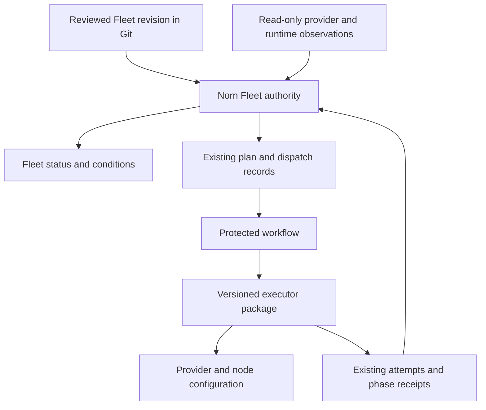

# Fleet controller proposal (input)

Source proposal for the Fleet controller work on `feature/v3-fleet-controller`
(cut from `codex/v3-m5-forward-recovery` at `7ea5895f`). The reviewed
implementation plan lives in [`plan.md`](./plan.md). This pass covers changes
1–4 (Norn only); executor packaging, workflow migration, and CLI/UI (5–7) are
deferred.

---

**The controller is worth implementing, but it should extend Norn's existing Fleet authority and consolidate the executor around it.**

Reviewed against Norn `master` at `600daf0` and Fleet `main` at `cffab53`. Norn already has durable plans, dispatch reservations, runner attempts, retry lineage, signed acceptance, and evidence-gated transitions. The missing pieces are a coherent Fleet resource, continuous observation, shared lifecycle semantics, and a packaged executor.

## Five design constraints

1. **Avoid a second operation ledger.** A new `FleetOperation` with its own mutable execution state would compete with existing operations, dispatches, and attempts. The Fleet resource should reference those records and derive its status from them.
2. **Unify PostgreSQL and etcd behavior.** The protected branch has materially separate Fleet lifecycle implementations. Adding controller logic independently to both would deepen that divergence. Extract a shared transition service, with backend adapters enforcing the same transactional contract.
3. **Add execution exclusion across plans targeting the same infrastructure.** Existing Norn locks are primarily scoped to a plan; GitHub concurrency groups serialize named environments. Two different plans or differently named roots can still represent the same infrastructure. Execution ownership needs a durable target identity that survives workflow renaming and aliases.
4. **Preserve credential boundaries within the shared artifact.** Current workflows scope credentials to individual steps. Use one released executor package with several short-lived, credential-scoped invocations.
5. **Represent approval accurately.** Current controls are protected main, checks, bound artifacts, and authorized dispatch (no environment reviewer protection, no required independent review). The controller must report the actual approval policy.

## Architecture

Initially the controller runs as a module in the existing management authority process. Its management state and executor remain outside the target Fleet.

## Resource model

| Record | Purpose and ownership |
|---|---|
| `Fleet` | Stable identity, accepted Git revision, desired generation, execution target, policy, and status |
| Existing capacity plan | Immutable proposed change and its baseline provenance |
| Existing dispatch | Authorized workflow binding and external dispatch outcome |
| Existing runner attempt | Executor identity, current phase, liveness, revision, and retry lineage |
| Existing reconciliation receipt | Evidence that a particular phase completed |
| Observation snapshot | Timestamped provider/state/runtime facts, with source and evidence references |

Git remains the source of desired infrastructure. A pending proposal must not silently become the accepted desired revision.

Fleet status exposes: desired generation and source digest; last evaluated and last successfully applied generation; active plan/dispatch/attempt references; conditions `ProviderStateKnown`, `NodesEnrolled`, `RuntimeReady`, `IngressReady`, `DriftDetected`, `ReconciliationRequired`; observation timestamps, freshness, reasons, evidence references.

A completed deployment remains a historical fact. An old successful check cannot keep readiness green indefinitely: stale evidence produces `Unknown`.

## Execution invariant

**One unresolved mutation owner per infrastructure target.** Canonical target identity from verified provider account/project and state backend identity; root names and environment aliases resolve to it. At execution admission bind plan, dispatch, attempt, and fence generation to it. The target stays occupied while an operation is active **or its external outcome is uncertain**; heartbeat expiry alone cannot release it. Recovery retains existing predecessor-stop checks. A second plan can be prepared/reviewed while execution is occupied but must be revalidated before execution.

## First controller release

Observe continuously; execute only explicit operations. Events from accepted plans, dispatches, checkpoints, and attempts enqueue reconciliation; a bounded periodic rescan catches missed events and stale observations. Reconciler updates Fleet status with CAS against authority epoch, desired generation, and resource revision. Provider observations come from a read-only executor profile; the Norn API holds no provider credentials. No automatic drift repair.

## Changes

| Change | Deliverable | Acceptance |
|---|---|---|
| 1. Freeze the lifecycle contract | Map every route, phase, credential boundary, approval rule, and supported operation across PG and etcd; record controller decision in architecture docs. | Every existing behavior has an owner and a retained regression test; backend differences explicit. |
| 2. Extract shared Fleet lifecycle semantics | One domain service for attempt admission, heartbeat, advancement, recovery, checkpoint validation; existing API shapes preserved via adapters. | PG and etcd pass the same behavioral suite without weakening existing checks. |
| 3. Target execution ownership | Canonical target registry and durable mutation fence integrated with dispatch/attempt admission. | Different plans and aliases cannot execute against the same target concurrently or bypass unresolved outcomes. |
| 4. Fleet resource and observer | Bounded desired-state/status storage, observation ingestion, reconciliation worker, read API. | Accurate status across successful deployment, drift, stale observations, interrupted execution, controller restart. |
| 5. Package the executor | (deferred) | |
| 6. Migrate one standard workflow | (deferred) | |
| 7. CLI/UI and expanded profiles | (deferred) | |

## Qualification matrix (relevant to 1–4)

- Two controllers writing status simultaneously; an old controller resumes after losing ownership.
- Two distinct plans, including root aliases, targeting one backend.
- Provider mutation succeeds but its response or checkpoint is lost.
- Checkpoint succeeds but the executor crashes before receiving confirmation.
- GitHub dispatch outcome is ambiguous.
- Desired revision changes during execution; the active attempt retains its original binding.
- Old observations arrive after newer failures and cannot clear them.
- Authority restore invalidates old ownership while preserving operation history.
- PostgreSQL and a real three-member etcd deployment exhibit the same relevant behavior.

Success measure: **one Fleet record explains what was requested, what exists, what is running, what is blocking progress, and which supported action comes next.**
